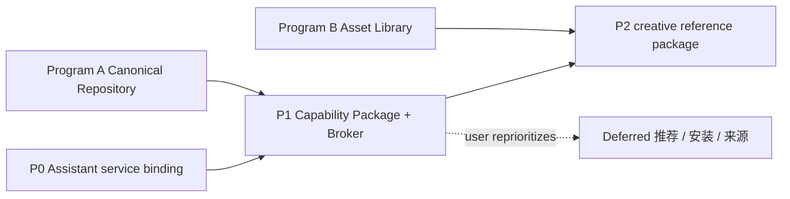

# Harness Home Program C — Assistant 服务激活与统一能力包

> 创建时间：2026-08-04
> 最后更新：2026-08-04
> 状态：📋 按用户纠正与竞品调研重写完成，待 Claude Code 审查；尚未授权进入代码实施
> 父计划：[harness-home-user-owned-core.md](harness-home-user-owned-core.md)
> 研究依据：[harness-home-capability-creative-systems-2026-08-04.md](../../research/harness-home-capability-creative-systems-2026-08-04.md)
> 接管：[旧 Design Method Program](../superseded/harness-home-design-method.md) 的未完成产品化方向；已落地的 Method/Taste/creative-project foundation 保留兼容，但不再作为独立产品主线
> 实施基线：`main@979fda51`，`package.json=0.65.0`

## 1. 用户问题与本轮纠正

Harness Home 的当前目标是让用户在不同 Harness 和模型下持续拥有三类东西：

1. **Assistant State**：助理身份、Memory、Heartbeat 等长期状态；
2. **Capability Packages**：Skill、MCP、CLI、内置工具、renderer 和 model adapter 组成的统一能力；
3. **Assets**：过去生成或收集的图片、视频、音频、网页及其 provenance。

本轮纠正两处过度拆分：

- **助理目录不做文件隔离。** 用户若把助理目录选为项目目录，`AGENTS.md`、`CLAUDE.md`、`instructions.md`、`memory.md` 和其他文件都应保持自然可读。需要显式激活的是 Memory 自动搜索/注入/写回、助理身份合成与 Heartbeat，不是文件本身。
- **能力不在产品层拆成“真实定义”和“执行状态”两个世界。** Skill、MCP、CLI 等属于同一个 Package，并能通过受控 Broker 相互调用。内部仍要保留 adapter 和执行证据，防止假成功，但用户只管理一个对象、一次安装和一个生命周期。

推荐安装页暂缓。设计、可视化、图片和视频能力作为首个完整 Package 验证效果、policy 适配与未来模型扩展，不新建 workflow engine。

```text
Files stay readable.
Assistant services activate explicitly.
Capabilities install and invoke as one package.
Assets preserve the results and lineage.
```

## 2. 当前事实底座（v0.65）

### 2.1 当前实现把目录相等同时当作文件上下文和助理服务开关

- `src/lib/context-assembler.ts:assembleContext` 在 `session.working_directory === assistant_workspace_path` 时加入助理 identity、Memory hint 与助理 instructions；
- `src/lib/claude-client.ts`、`src/lib/codex/runtime.ts`、Codex MCP config 和 CodePilot builtin memory tools 各有同类 cwd 判断；
- `chat_sessions` 没有独立的 assistant service binding；普通聊天和 `/api/workspace/session` 最终都调用 `createSession()`；
- 最近完成的规则镜像会把 canonical rules 投影为 `CLAUDE.md` / `AGENTS.md`，这些文件本来就应由对应 Runtime 按项目规则正常加载；
- Harness Home projection 可包含 memory refs，但当前没有“普通文件可见”和“助理语义服务自动启用”两层合同。

现状的真正问题不是项目能读取某个文件，而是产品可能仅凭 cwd 相等自动挂载整套助理服务。

### 2.2 Skills、MCP 与 CLI 仍是多套入口

- `/api/skills` 能发现部分 `~/.agents/skills` / `~/.claude/skills`，但项目级和执行链仍偏 Claude；
- Marketplace install 硬编码 `--agent claude-code`；
- Harness Home 已能保存 canonical Skill/MCP definition，但 projection 仍以 `perceptible_only` 为主；
- Claude/CodePilot 有不同 MCP 执行链，Codex 用户 MCP 仍未统一；
- CLI 有独立 catalog 和页面，不是 Harness Home canonical package surface；
- Skill canonical representation 仍偏单 Markdown，不能完整携带 `scripts/`、`references/`、`assets/`。

因此用户目前会看到多个配置入口，也无法用一个稳定 ID 让 Skill 调 MCP、CLI、媒体模型和 renderer。

### 2.3 创作能力已有零件，但没有统一包和模型合同

- `WIDGET_SYSTEM_PROMPT` 保留最小 `show-widget` wire contract；
- `codepilot_load_widget_guidelines` 按需提供设计/可视化规范；
- `show-widget`、HTML、图片与视频已有 Artifact/Asset 消费路径；
- 三个 Runtime 各有不同工具桥；tech debt #56 仍记录 CodePilot Runtime widget 自动触发缺真实收口；
- 当前媒体接入还缺统一的 operation/input/output/job/cost/policy descriptor，继续接更多图像和视频模型会重复写 Provider 特例。

## 3. 外部参考与取舍

调研详见研究文档，结论如下：

| 项目 | 借鉴 | 明确不照搬 |
|------|------|------------|
| goose | Extension/Recipe/MCP App 在一个使用面；Auto Visualiser 用预制模板保证可视化下限 | 不新增 Recipe/workflow 产品层 |
| Dify | manifest 声明能力/权限；插件可反向调用已安装工具 | 不把 model/tool/Skill 拆成多个用户安装对象 |
| Open WebUI | 文件、Memory、工具与权限分别门控；同一会话按平台/model/permission 决定工具 | 不复制其多套 Tool taxonomy 到产品 UI |
| ComfyUI | model/node capability、异步 job、依赖与 provenance | 不复制节点画布；ComfyUI 只是一个可选 adapter |
| FLORA | 多模型统一入口、reference asset、批量变体与后续编辑 | 不把 CodePilot 主交互改成无限画布 |

采用原则：**统一产品对象，保留内部安全边界；借鉴模型与工具适配，不复制重型 UI。**

## 4. 共享领域合同

### 4.1 普通文件可读，Assistant services 显式激活

目标合同不是 `assistant | project` 文件权限 profile，而是一个窄的服务绑定：

```ts
interface AssistantServiceBinding {
  assistantRef: string;
  activatedBy: 'assistant_entry' | 'heartbeat';
  activatedAt: string;
}

interface SessionContext {
  workingDirectory: string;
  assistantServiceBinding?: AssistantServiceBinding;
}
```

硬规则：

1. `workingDirectory` 继续决定普通文件 cwd；项目选择助理目录时，不隐藏、不移动、不拒绝读取其中任何文件；
2. `AGENTS.md`、`CLAUDE.md` 和其他 Runtime 原生规则按各自正常发现机制加载，不因是否从“个人助理”入口进入而拆散；
3. `memory.md` / daily memory 是用户文件：用户显式 `@file`、要求读取或通过普通文件工具访问时允许；
4. 只有从个人助理入口创建/认领的会话才获得 `assistantServiceBinding`；普通聊天、项目入口与任务派生不会因为 cwd 相同而自动升级；
5. binding 只自动开启助理 identity 合成、Memory hint/search/index/writeback/extraction 与 Heartbeat target；它不授予额外文件系统权限；
6. 切换助理目录后旧 binding 不自动指向新目录；重新进入助理时显式认领或新建会话；
7. 旧 session 没有 binding 时按普通文件会话运行；从个人助理入口重新打开时用 CAS 绑定，不能批量按路径误判；
8. 未来若做 project memory，应有独立 scope 和写回规则，但仍不需要禁止普通文件读取。

这解决的是“自动行为是否激活”，不是建立沙箱或隐私 ACL。用户若主动把包含个人内容的目录当项目打开，文件可见是其明确选择。

### 4.2 Capability Package 是用户管理的最小单位

```ts
interface CapabilityPackageManifest {
  id: string;
  version: string;
  scope: 'builtin' | 'user' | 'project';
  skills: SkillBundleRef[];
  actions: CapabilityActionDescriptor[];
  renderers?: RendererDescriptor[];
  modelAdapters?: MediaModelAdapterDescriptor[];
  provides: CapabilityActionId[];
  requires: CapabilityRequirement[];
  optional: CapabilityRequirement[];
  permissions: CapabilityPermission[];
  secretRefs: SecretRef[];
  provenance: Provenance;
}

type CapabilityActionKind =
  | 'mcp_tool'
  | 'cli'
  | 'builtin'
  | 'model_operation'
  | 'renderer';
```

产品规则：

- 一个 Package 可以同时包含 Skill、MCP、CLI、renderer 和 model adapter；
- 用户安装、更新、授权、禁用和卸载的是 Package，不是散落的五份副本；
- UI 的主状态只有 `可用`、`需要授权`、`需要修复`、`已禁用`；Runtime adapter 细节进入诊断，不作为多个“安装状态”平铺给用户；
- Package 只有在 canonical bundle 校验成功、依赖可解析、启用的 Runtime bridge 能暴露其公共 actions 后才是 `可用`；
- 某个 action 受当前 model/policy 限制时，在调用点返回具体原因，不把整个 Package 伪装成功，也不创建第二个对象。

内部仍保留 Source Adapter、Runtime Bridge、provider adapter 和 conformance evidence；这是实现和审计边界，不是产品概念。

### 4.3 Capability Broker 负责相互调用

```text
Skill requests capability/action
  -> Broker resolves package + dependency + policy
  -> Runtime bridge invokes MCP / CLI / builtin / model adapter
  -> action may call another declared action through Broker
  -> typed Artifact / AssetRef / text result returns
```

硬规则：

1. Skill 只引用 stable `packageId/actionId`，不写死 `.claude`、`.agents`、Codex home 或某个 Provider 私有命令；
2. MCP/CLI/model action 若需调用其他能力，必须通过 Broker reverse invocation，且目标出现在 `requires`/`optional`；
3. Broker 每次调用重算 permission、secret、network、process、scope、Runtime 与 model policy，不继承调用方的高权限；
4. 调用图记录 parent/child invocation id、输入输出 schema、耗时、失败与 Artifact/Asset provenance；
5. 最大深度、最大 fan-out、超时、取消、cycle detection 与 budget fail-closed；
6. CLI 使用 argv 执行与明确 cwd/env allow-list，模型输入不进入 shell；
7. 任何 action 不得把工具说明或假的 success text 当作真实调用结果。

这不是 workflow engine：不新增节点数据库、画布或第二套 scheduler。Skill 仍描述步骤，Broker 只提供受控组合与执行。

### 4.4 跨 Runtime 使用同一个 Package

首版桥接方向：

- **Claude Code**：managed Skill projection + CodePilot Capability MCP bridge；
- **Codex**：managed Agent Skill projection + per-thread/user MCP bridge，以 bundled app-server 真实 POC 为准；
- **CodePilot Runtime**：progressive Skill loader + native ToolSet/CLI/media adapters；
- **未来 Runtime**：优先接一个统一 Broker surface，再补原生体验，不复制 Package 数据。

managed projection 只是 Runtime 兼容物：带 provenance/hash，用户修改后冻结，卸载只删同 provenance 且同 hash 的受管副本。Package 本体仍在用户拥有的 Harness Home repository 中。

### 4.5 创作 Package 的质量与模型适配

首个 reference package 暂以 `creative` 表示，名称在 UI 实施前由用户确认。它至少提供：

```text
creative.visualize.explain
creative.ui.generate
creative.image.generate / edit / upscale
creative.video.generate / image_to_video / edit
creative.asset.continue
```

#### 效果质量

- 解释型可视化优先选经过验证的 chart/diagram/UI primitives 和布局模板；模型负责选型与填数据，不任意拼一套不可控 UI；
- 生成式媒体使用 model-specific prompt compiler、reference asset、参数校验与输出 validator；
- 保留一个小而真实的 quality fixture 集：数据图、结构图、交互解释、图片生成、image-to-video 各至少一个；不恢复大型 golden brief/Design Method program；
- 自动门禁验证 schema、溢出、主题、可访问性、文件完整性、尺寸/时长和 lineage；审美好坏由 human gate 与用户选择验证，不伪造数值分数；
- 一次选择不自动写成跨项目 Taste Memory。项目 art direction 由 project Skill/config 明确提供。

#### Policy 适配

本计划把“不同类政策”解释为 Runtime、model、permission、安全/区域、成本和数据处理政策：

- 当前 Runtime 是否支持 structured tool call、MCP、renderer、异步 job；
- 当前模型对工具调用和输入/输出模态的支持；
- permission profile、文件/网络/进程、Secret、用户确认；
- Provider 的 safety、region、credits、cost、concurrency、retention；
- project/user scope 和 Asset export policy。

Skill 请求 action，Broker 选择满足 policy 的 adapter；没有满足条件的路径时诚实失败，不暗中换模型、降画质或把敏感素材发到另一 Provider。

#### 更多图像/视频模型

`MediaModelDescriptor` 首版至少声明：

- provider/model/version/region；
- operations：t2i、i2i、inpaint、outpaint、upscale、t2v、i2v、reference-to-video、video edit；
- input slots、reference 数量与类型、aspect ratio、resolution、duration、fps、output mime；
- sync/async、poll/cancel、并发、预计耗时/成本；
- safety/permission/secret requirements；
- normalized Artifact 与 Asset materialization contract。

`MediaProviderAdapter` 负责 credential validation、capability discovery、request validation、submit/poll/cancel 和 result normalization。ComfyUI 可作为一个 adapter；直接云 Provider 与未来本地模型使用同一接口。

## 5. Phase 计划与优先级

### P0 — Assistant service activation binding

**目的**：不拆散助理目录，只消除 cwd 自动开启整套助理服务的歧义。

#### 用户会看到什么

- 从个人助理入口聊天时，Memory 搜索/写回、助理身份和 Heartbeat 正常工作；
- 把同一目录用于项目聊天时，`AGENTS.md` / `CLAUDE.md` 与普通文件仍可读，但不会自动出现个人 Memory hint、Memory tools 或写回；
- 用户显式要求读取 `memory.md` 时仍可读取，不出现“这是助理文件所以禁止访问”的假权限。

#### 实施范围

- 给 session 增加 additive `assistant_binding_ref` 与 activation provenance；
- 个人助理 session route、Heartbeat lazy session 显式创建/认领 binding；普通创建、项目与 task session 不写 binding；
- 建立共享 `resolveAssistantServiceBinding()`，替换 context assembler、Memory MCP/builtin、extractor/indexer/writeback 与 Heartbeat 的 cwd 激活判断；
- 明确 rules/普通 file discovery 不消费该 binding；
- 旧会话从助理入口打开时 CAS 认领，迁移记录 matched/claimed/skipped/conflict 数量。

#### 验收

| 场景 | 必须结果 |
|------|----------|
| Assistant entry + assistant dir | rules/普通文件可读；Memory 自动服务与 Heartbeat 可用 |
| Project entry + ordinary project dir | 项目规则/文件可读；无个人 Memory 自动服务 |
| Project entry + assistant dir | `AGENTS.md`/`CLAUDE.md`/`memory.md` 可显式读取；无 Memory hint/tool/writeback/Heartbeat |
| Old session reopened through Assistant | CAS 绑定成功且不改变 cwd/file visibility |
| Assistant path switched | 旧 binding 不指向新助理；普通文件行为不受伪权限影响 |

P0 blocker：任何 Memory 自动注入、搜索、写回、索引或 Heartbeat 仍只凭 cwd 相等激活；或实现通过隐藏/拒绝文件来达成隔离。

### P1 — Capability Package + Broker + Runtime Bridges

**目的**：安装一个整体，并让其中的 Skill、MCP、CLI、renderer/model actions 可以相互调用、跨 Runtime 使用。

#### 用户会看到什么

- Skills、MCP、CLI 不再是三个互不相干的安装项；
- 同一 Package 在 Claude、Codex、CodePilot 聊天中都以同一名称和能力工作；
- 需要 Secret 时统一授权；依赖断裂时统一提示“需要修复”，不显示一串内部 adapter badge；
- 项目 Package 只对当前项目生效，用户 Package 不被无 provenance 地复制进项目仓库。

#### 实施范围

1. 将 Harness Home definition 升级为 directory Skill bundle + actions + renderer/model adapters 的 package manifest；
2. 建立 Package Registry，合并 canonical、`.agents`、`.claude`、CodePilot legacy、project-local 与 plugin sources；
3. 建立 Broker：resolve、invoke、reverse invoke、permission/secret policy、cycle/budget/cancel 与 trace；
4. 建立三 Runtime bridge，并以真实 bundled Runtime POC 锁定 Skill 与 MCP wire；
5. 现有 Skills、MCP manager、CLI catalog API 迁为同一 Registry/Broker 的兼容消费者；
6. canonical-first 安装、managed projection、conflict-aware update/uninstall；
7. 保留内部 adapter diagnostics，但产品状态聚合到 Package。

#### POC 与 conformance 门禁

- 一个 fixture Package 同时含 `SKILL.md + reference + script + MCP action + CLI action`，Skill 调 MCP，MCP 再通过 Broker 调 safe CLI，并返回 typed Artifact；
- 三 Runtime 从同一 package ID 调用，调用 trace 与结果 schema 一致；
- Runtime bridge 没有真实 wire 时 Package 进入 `需要修复`，不能用 prompt 说明冒充执行；
- reverse invocation 覆盖 permission downgrade、cycle、depth、timeout、cancel 与 secret redaction；
- 同 canonical ID/hash 的受管 projection 合并为一个 Package；同名不同 hash 冲突，不按时间覆盖；
- update/uninstall 不删除 unmanaged 或用户修改的目录；
- project scope 不泄漏到其他项目；Runtime 切换/discovery 不写 canonical；
- Windows/macOS/Linux 的 symlink/junction/copy 语义与冲突提示有行为测试和 packaged smoke。

### P2 — `creative` reference package 与媒体模型层

**目的**：用真实高价值能力证明 P1 不是只有 schema，并建立后续图像/视频模型的低成本接入路径。

#### 用户会看到什么

- 同一能力可完成可视化解释、交互 UI、图片生成/编辑和视频生成/续作；
- 系统根据当前任务、Runtime、模型、权限和 Provider policy 选择真实可用路径；
- 不支持时说明具体缺口，不给假 Widget/假 Asset；
- 生成结果进入素材库，可从历史 Asset 继续创作，并看见模型/参数/引用素材 lineage。

#### 实施范围

1. 把现有 visualize 方法、widget guideline 与设计质量规则整理为 progressive Skill；
2. 把 `show-widget`、image/media tools、HTML producer 与 Asset materializer 注册为 Package actions；
3. 建立 `MediaModelDescriptor` / `MediaProviderAdapter` / normalized media job；
4. 先接当前已有真实 image/video producers，再用一个能力差异明显的第二 Provider/模型验证扩展性；
5. 解释型可视化采用受控 primitives/templates；媒体采用 model-specific prompt compiler 与 validator；
6. 运行小型 quality fixtures + human gate；
7. 关闭或重写 tech debt #56，并验证 preview 不重复入库。

#### 验收

- 可视化数据正确、布局不溢出、深浅主题和 reduced motion 合格；
- 一个 image edit/reference 场景与一个 image-to-video 场景使用真实模型完成；
- 同一请求在不同 Runtime 通过同一 action ID 发起，policy 不同只改变 adapter 决策，不改变 Package 身份；
- 模型不支持 input/reference/duration 时在 submit 前 fail-fast；
- Artifact → materialization → Asset lineage 含 package/action/provider/model/input refs/job/hash；
- 用户比较/选择保留为本次 creative project 证据，不自动升级为长期审美偏好。

### Deferred — 推荐、安装与来源页面

用户本轮明确“推荐安装先不着急”。因此：

- 不实现 Marketplace、curated catalog 或私有 GitHub source UI；
- 现有 `/plugins` 保持兼容，不用临时页面反向塑造 Package schema；
- 用户自己的 Skills 未来可以作为 curated/preinstalled/source 候选，但需等 P1 安装/权限/签名/更新合同稳定；
- 重启条件：P1 三 Runtime Package smoke 通过，且用户再次确认推荐页优先级。

## 6. 依赖顺序



P0 解决自动服务语义；P1 是核心平台；P2 用效果和多模型验证平台。推荐页不在关键路径。

## 7. 风险与防线

| 风险 | 后果 | 防线 |
|------|------|------|
| 把助理目录误做成文件沙箱 | 用户主动选择目录后反而读不到自己的文件 | file readability 正例测试；binding 只门控自动服务 |
| 继续用 cwd 激活 Memory 写回 | 项目聊天无意写个人 Memory | explicit binding + shared resolver + three-Runtime negative tests |
| Package 只是 UI 合并，执行仍互不相通 | “一个整体”成为文案 | Broker reverse-invocation fixture + trace + real Runtime smoke |
| 为了统一而隐藏失败 | 模型假装有工具 | Package 聚合状态 + action-level fail-fast + adapter diagnostics |
| reverse invocation 权限继承 | CLI/Secret 越权 | per-hop policy + least privilege + cycle/depth/budget limits |
| 把所有媒体模型压成通用表单 | 新模型接入继续写特例，能力被误报 | model descriptor + adapter conformance + unsupported-before-submit |
| 生成式 UI 效果漂移 | 看似能生成但质量不稳定 | curated primitives/templates + compact quality fixtures + human gate |
| 重新长成 workflow/审美大系统 | 计划无法关闭 | Skill describes steps；Broker executes；no canvas/scheduler/Taste auto-learning |
| 推荐页提前 | 安装成功/可用状态再次造假 | deferred until P1 smoke and user reprioritization |

## 8. 完成状态

- **P0 Complete**：binding migration、所有入口与三 Runtime 自动服务正反例完成；普通文件可读正例必须同时通过；
- **P1 Code complete**：Package/Registry/Broker/bridges/conformance 完成；
- **P1 Smoke passed**：Claude、Codex、CodePilot 各从同一 Package 完成 Skill → MCP → Broker action 真实调用；
- **P2 Complete**：`creative` 在支持路径真执行、在不支持路径真降级，质量与 Asset lineage 通过 human gate；
- 推荐页不属于本轮完成条件。

## Smoke Ledger

> 自动化测试不能把 Runtime bridge、Broker 调用、媒体效果或 UI 状态标成真实可用。每次 smoke 记录 bundled Runtime/adapter 版本、Package hash、action、policy 与去敏证据；不得写 Secret。

| Date | Phase | Runtime | Package / action | 场景 | Result | Evidence |
|------|-------|---------|------------------|------|--------|----------|
| _待执行_ | P0 | 三 Runtime | Assistant services | 同 cwd，不同 entry；文件可读但自动服务不同 | ⏳ | session ids + redacted context/tool catalog |
| _待执行_ | P1 | claude_code | fixture package | Skill → MCP → Broker CLI → Artifact | ⏳ | package hash + invocation trace |
| _待执行_ | P1 | codex_runtime | fixture package | install once → invoke/resume | ⏳ | app-server version + thread id + trace |
| _待执行_ | P1 | codepilot_runtime | fixture package | progressive load → permission → invoke | ⏳ | provider/model + tool events |
| _待执行_ | P2 | 三 Runtime | creative.visualize | data → template Artifact | ⏳ | screenshot + artifact id |
| _待执行_ | P2 | supported adapters | creative.image/video | reference Asset → generation → Asset | ⏳ | provider/model/job + asset lineage |

## 9. Claude Code 审查清单

1. P0 是否只门控助理自动服务，而没有隐藏/拒绝 `AGENTS.md`、`CLAUDE.md`、`memory.md` 等普通文件；
2. rules 原生加载与 Assistant service binding 是否真正独立；
3. 旧 session 是否只从明确助理入口 CAS 绑定，没有按路径批量误判；
4. Package 是否是唯一用户管理对象，Skill/MCP/CLI/renderer/model adapter 是否能共存；
5. “相互调用”是否通过 Broker 且覆盖 permission downgrade、cycle、budget、cancel 与 trace；
6. 三 Runtime 是否从同一 Package ID 调用真实 wire，而不是只看到 prompt 说明；
7. 内部 adapter 诊断是否保留反假数据证据，同时没有泄漏成多个产品对象；
8. directory Skill 是否完整支持 scripts/references/assets 和 symlink/path/size/executable 边界；
9. creative quality 是否分别验证解释型可视化与生成式媒体，而非用一个假分数；
10. MediaModelDescriptor 是否足以表达 image/video operation、inputs、job、cost、safety 与 output；
11. policy resolution 是否覆盖 Runtime/model/permission/Provider/region/cost/data handling，且不暗中换模型；
12. 推荐安装是否确实 deferred，没有 marketplace 旁路写 `.claude` 或提前做 UI。

## 10. 决策日志

- 2026-08-04：初稿把“项目不得自动加载个人 Memory”写成过强的文件/上下文隔离。用户纠正：若项目主动使用助理目录，目录中的 `AGENTS.md`、`CLAUDE.md`、`memory.md` 和其他文件都应自然可读。
- 2026-08-04：计划改为窄 `AssistantServiceBinding`。它只控制 identity/Memory 自动服务与 Heartbeat，不成为文件权限或 cwd 沙箱。
- 2026-08-04：用户拒绝在产品层把“真实定义”和“执行”分开表达。Skill、MCP、CLI、renderer、model adapter 统一为一个 Capability Package；内部 adapter/证据边界继续保留，用于真实执行和诊断。
- 2026-08-04：Package 内与 Package 间通过 Capability Broker 相互调用，不新增 workflow engine。
- 2026-08-04：推荐安装页后移，不属于当前关键路径。
- 2026-08-04：设计/可视化/图片/视频成为 `creative` reference package；优先验证效果、policy 适配与 image/video model descriptor，不恢复独立 Design Method/Taste 产品主线。
- 2026-08-04：竞品调研采用 goose 的统一使用面和模板化可视化、Dify 的反向调用、Open WebUI 的文件/Memory/权限分层、ComfyUI 的模型能力与 job 描述、FLORA 的 reference/多模型创作；不复制节点画布或无限画布。
