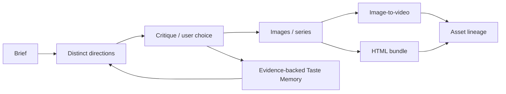

# Harness Home Program C — CodePilot Design Method

> 创建时间：2026-07-30
> 最后更新：2026-07-31
> 状态：🟡 C0 候选证据清单 + C1/C2/C3 foundation/API/tests 已完成；用户方法确认、golden set、真实 producer 与人工审美门禁待执行
> 父计划：[harness-home-user-owned-core.md](harness-home-user-owned-core.md)
> 依赖：Program A shared scope/provenance；完整创作 lineage 依赖 Program B

## 目标

把用户真实的设计方法、美学判断和图像/视频/网页联动流程沉淀为可触发、可版本化、可评审、可覆盖的 CodePilot Design Method，而不是一段泛化“AI 审美”提示词。

本计划是产品 R&D 与人工验收计划，不与 Harness Core 工程或 Asset DB migration 共用完成状态。

## 状态

| Phase | 内容 | 状态 | 入口门禁 |
|-------|------|------|----------|
| C0 | 真实案例、反例、选择理由与方法素材采集 | 🟡 4 组真实产品 brief 已建候选清单；通用方法归属与 Asset 证据待用户确认 | 用户提供/确认真实素材 |
| C1 | Design Method v0 + golden set + critique rubric | 🟡 versioned store、candidate/confirmed、rubric、trigger/non-trigger、progressive disclosure 与三 Runtime 投影已完成；v0 pack / golden set 待确认 | C0 素材足够且有用户确认 |
| C2 | Taste Memory 证据模型与撤销 | ✅ foundation/API/tests 完成；独立 UI 仍服从 Deferred UI 决策 | Program A scope/provenance frozen |
| C3 | 图片→视频→网页编排与 Asset lineage | 🟡 durable creative project、typed AssetRef/parent、Runtime/Provider checkpoint、unsupported degradation 已完成；真实 image→video→HTML run 待执行 | Program B typed AssetRef 可用 |

## 执行清单

- [x] C0 四组真实 CodePilot 产品 brief 候选证据清单
- [x] C1 candidate/confirmed/retired Method contract、selector、三 Runtime projection 与 API
- [x] C2 evidence-only Taste Memory、scope/conflict、编辑与撤销 API
- [x] C3 durable creative project、typed parent refs、checkpoint 与 unsupported degradation
- [x] Claude review hardening：method id/version、decision evidence、parent AssetRef、scope 与 Taste classification 服务端校验
- [ ] 用户确认可泛化的 Design Method v0
- [ ] 3–5 个 golden briefs、真实 image→video/HTML producer run 与人工审美门禁

## 用户会看到什么

CodePilot 能按照一套可识别的方法：

1. 理解并澄清 brief；
2. 给出真正不同的设计方向；
3. 生成、比较和修改图片；
4. 规划 image-to-video 镜头与运动；
5. 把素材落成网页；
6. 记录用户为什么选择或否决；
7. 在下次创作中引用可查看、可撤销的偏好证据。

## 明确不做

- 不先做大而全节点画布复制 Krea / FLORA。
- 不把“高级、优雅、电影感”等词当成方法。
- 不把每次选图自动推断为永久偏好。
- 不在缺少用户确认时修改 built-in method pack。
- 不把 Method 塞进每轮全局 system prompt。
- 不用模型自评代替用户对真实图片、视频和网页的验收。
- 不在 Program B producer 尚不存在时宣称 component/document 已进入 Asset lineage。

## C0 — 真实方法素材采集

来源只接受：

- 用户明确认可的作品；
- 用户明确否决的作品及原因；
- 实际使用过的 prompt / reference / workflow；
- 已有产品决策中关于层级、构图、字体、色彩、材质、动效和 macOS profile 的记录；
- 图片→视频、图片→网页的真实成功/失败案例。

每条素材至少记录：

- source ref；
- brief / task；
- accepted / rejected；
- 用户原话或可验证行为；
- 适用 scope；
- candidate principle；
- 反例；
- 是否经用户确认。

未确认内容只能标为 `candidate`。

### C0 输出

- 3–5 个真实 creative briefs；
- 每个 brief 的 accepted/rejected references；
- CodePilot Design Method v0 素材清单；
- 待用户确认问题，不替用户回答。

### C0 实施证据

- `docs/research/harness-home-design-evidence-inventory-2026-07-30.md` 已从 macOS shell、Chat composer、semantic icon、Markdown/Artifact 四组真实 brief 整理 source、accepted、rejected、reason、scope 与 candidate principles。
- 清单明确区分“已经确认的 CodePilot 产品决策”与“尚未确认的用户通用设计方法”；没有据此预装 confirmed Method 或 durable Taste Memory。
- 图片/视频/网页 Asset ID、字体/色彩/构图/运动节奏选择和 3–5 个 golden run 仍需用户提供/确认，不能由单元测试关闭。

## C1 — Method Pack

首版至少覆盖：

1. Brief clarification；
2. Reference decomposition；
3. 多方向生成，不是同 prompt 换 seed；
4. 层级、构图、色彩、字体、材质检查；
5. 图片一致性与系列化；
6. Image-to-video 镜头/运动规划；
7. 网页信息架构与视觉实现；
8. Critique / compare / select / revise；
9. 输出到 Asset lineage。

每个 Method 必须包含：

- id、version、source、changelog；
- trigger / non-trigger；
- inputs / outputs；
- steps；
- modality；
- references / counterexamples；
- critique rubric；
- user/project override 行为；
- progressive-disclosure entry。

### C1 foundation 实施证据

- `CreativeMethodDefinition` 已包含 `candidate | confirmed | retired`、title/summary、source/scope、trigger/non-trigger、inputs/outputs/steps/modalities、references/counterexamples、critique criteria、changelog、override policy 与 confirmation evidence。
- definition JSON 与 progressive guide Markdown 同一原子 generation 写入；乐观并发、hash、secret scan 和 repository consistency 复用 Program A write model。
- candidate / retired 永远不进入 turn；confirmed 仍需 evidence 可解析、scope 命中、prompt trigger 命中且不触发 non-trigger。
- Claude Code、CodePilot Runtime、Codex Runtime 都从真实 user prompt + workspace scope 调用同一 selector；不再把所有 creative method 塞进每轮全局 prompt。
- `/api/harness-home/design-methods` 提供 metadata/guide 的查看与候选/确认版本写入边界；app write 会拒绝不存在的 Asset ID 或未被 Harness manifest 索引的 portable evidence。
- 尚未创建 CodePilot Design Method v0 内容；这是有意保留的人类方法真实性门禁，不是遗漏。

### Golden set

每个 brief 至少运行：

- baseline：没有 Method；
- candidate Method；
- 反例输入；
- Provider/Model 切换；
- 用户 review。

结果不能只比较“更好看”。必须记录方向差异、criterion 命中、失败模式和用户选择理由。

## C2 — Taste Memory

只记录有证据的偏好：

- 用户明确陈述；
- 多方向选择/否决；
- 用户给出的修改原因；
- 项目级 art direction。

写入前分类：

```text
one-off decision
project preference
durable user preference
CodePilot built-in principle
```

每条 Taste Memory 必须包含：

- evidence ref；
- scope；
- confidence；
- createdAt / lastConfirmedAt；
- editable text；
- revoke/forget；
- affected methods；
- 冲突偏好处理。

### C2 完成标准

- one-off 不会自动升级 durable。
- 用户可查看、编辑和撤销。
- 撤销后后续 projection 不再注入。
- 跨项目默认不传播 project preference。
- 没有 evidence 的推断不能持久化。

### C2 实施证据

- `writeTasteMemory` 创建/编辑时强制 evidenceRef、classification、scope、confidence 与 stable preferenceKey；durable user preference / built-in principle 没有明确确认时间会被拒绝。
- project > assistant/user > builtin 的作用域优先级沿用 Program A；同一 preferenceKey 在同 rank 出现不同 statement 时不会按插入顺序偷偷选一个，而是 withheld + conflict diagnostic。
- revoke 保留记录和 reason，但后续 projection 不再注入；unavailable evidence 同样 fail-closed。
- `/api/harness-home/taste-memory` 支持查看、编辑（带 expected hash）与撤销；没有为了它提前拍板 Settings/Plugins/独立 Home 的 UI 归属。

## C3 — Creative Orchestration



模型路由是方法的一部分，但 Method 不绑定单一模型。Runtime/Provider 切换时，brief、method version、references、选择历史和 Assets 不丢。

### C3 完成标准

- 同一 brief 的方向有可解释差异。
- critique 引用明确 criterion。
- 图片→视频→html_bundle lineage 可追溯。
- 切换 Runtime/Provider 后继续同一 creative project。
- unsupported modality 有真实降级，不伪造完成。

### C3 foundation 实施证据

- durable creative project 保存 brief、method id/version、distinct directions、criterion refs、用户 selection/rejection evidence、typed AssetRef、parent Asset IDs 和 Runtime/Provider/Model checkpoint。
- directions 少于两个或 rationale 重复会被拒绝；choice 没有 evidence、Asset kind 与 stage 不匹配、未知 producer-backed kind 同样 fail-closed。
- Runtime/Provider 切换只追加 execution checkpoint，不改 brief、method、decision 或 Asset lineage；unsupported image/video/html stage 以 reason 明确记录，不创建假 Asset。
- `/api/harness-home/creative-projects` 提供同一 canonical repository 中的 durable load/save；真正的 image→video→html_bundle producer run 和用户视觉验收仍在 Human gate。

## 用户验收门禁

以下情况必须由用户看真实结果：

- 方向是否真正不同；
- 视觉层级、构图、字体和色彩是否符合方法；
- 图片系列一致性；
- 视频镜头/节奏；
- 网页信息架构和视觉实现；
- Taste Memory 是否准确、是否越界；
- built-in method 是否真的包含用户的方法。

Snapshot、模型自评和单元测试不能单独关闭这些门禁。

## 验证分层

| 层 | 内容 |
|----|------|
| Tier 0 | Method metadata/schema、scope、evidence required、revoke |
| Tier 1 | progressive disclosure、projection、Provider/Runtime switch、Taste conflict |
| Tier 2 | 真实图片/视频/HTML producer 与 Asset lineage |
| Human gate | 3–5 个 golden briefs 的方向、质量、节奏和方法真实性 |

## Smoke Ledger

> 本 program 的关键结果同时需要 smoke evidence 与用户人工审美验收；`Result` 不得仅凭模型自评或 snapshot 填为通过。

| Date | Brief | Method version | Provider / Model | 输出 | Result | Evidence |
|------|-------|----------------|------------------|------|--------|----------|
| _待执行_ | golden brief 1 | v0 candidate | TBD | directions + images | ⏳ | asset ids / user notes |
| _待执行_ | golden brief 2 | v0 candidate | TBD | image → video | ⏳ | video id / critique |
| _待执行_ | golden brief 3 | v0 candidate | TBD | image → html_bundle | ⏳ | bundle hash / screenshot |
| 2026-07-30 | foundation conformance | candidate + confirmed fixtures | 三 Runtime projection | method/taste/project contracts + API | ✅ Tier 0/1：10/10；组合回归 24/24；全量 4866/4866 + production build | `harness-home-design-method.test.ts`；`harness-home-design-api.test.ts`；无模型自评 |
| 2026-07-31 | foundation review | candidate/confirmed fixtures | 三 Runtime projection | invalid scope/classification/method/evidence/parent refs fail-closed | ✅ 纳入定向 65/65、全量 4904/4904 与 production build | review fix `ef396b0d`；`harness-home-design-api.test.ts` / `harness-home-design-method.test.ts`；无模型自评 |
| 2026-07-31 | poison-read follow-up | candidate/confirmed fixtures + invalid persisted record | 三 Runtime projection | 单条非法 Taste Memory 被诊断隔离；其余合法 Taste 继续投影；L1 import 复用 evidence 校验 | ✅ follow-up 三组 51/51；全量 4909/4909；production build | fix `fb77d434`；`harness-home-design-method.test.ts` / `harness-home-repository.test.ts`；无模型自评、未创建用户 Taste |
| 2026-07-31 | activation validation | candidate/confirmed fixtures + poisoned persisted Method | 三 Runtime projection | 空白 trigger、控制字符 non-trigger 写入拒绝；历史 poison Method 读取 fail closed | ✅ 六个相关文件 76/76；全量 4917/4917；production build | fix `1dea192d`；`harness-home-design-method.test.ts`；无模型自评、未创建用户 Method/Taste |

## 决策日志

- 2026-07-30：Design Method 从工程 umbrella 拆为独立产品 R&D program。
- 2026-07-30：built-in method 必须来自真实案例、反例和用户确认，不由模型生成品牌话术。
- 2026-07-30：Taste Memory evidence-only、分 scope、可查看、可编辑、可撤销。
- 2026-07-30：创作联动只引用 Program B 已注册的 producer-backed Asset kinds。
- 2026-07-30：用户授权 Codex 直接实施，明确不启动 loop；push、merge、release 未授权。
- 2026-07-30：候选方法与 confirmed 方法分开；confirmed 仍必须有可解析证据，跨设备 unresolved 不进入模型上下文。
- 2026-07-30：Method 使用 prompt trigger + non-trigger + scope 做 progressive disclosure，默认每轮不加载。
- 2026-07-30：同 rank 的冲突 Taste Memory fail-closed，不按最后写入或 confidence 静默覆盖。
- 2026-07-30：UI 入口继续服从 umbrella 的 Deferred UI 决策；本轮只提供 canonical file/API/Runtime surfaces，不把 Harness Home 强塞进 Settings 或 Plugins。
- 2026-07-31：review hardening 只加强证据与引用真实性，不据此创建 Method v0 或用户 Taste；schema/API 全绿仍不能替代用户的设计选择。
- 2026-07-31：`fb77d434` 将历史 Taste poison 从“整组读取失败”降为“单记录可归因诊断”；该韧性修复不改变 evidence-only 门禁，也不把损坏记录静默修复或送入模型上下文。
- 2026-07-31：`1dea192d` 明确 Method progressive disclosure 的激活短语不是自由文本兜底：trigger/non-trigger 必须非空、有界且无控制字符，write/import/read 一致 fail closed；不据此生成任何新方法内容。
