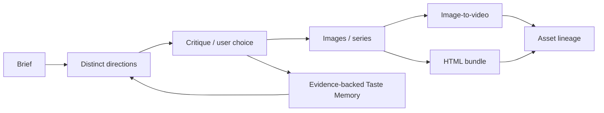

# Harness Home Program C — CodePilot Design Method

> 创建时间：2026-07-30
> 最后更新：2026-07-30
> 状态：📋 真实案例采集待开始；**未授权产品代码实施**
> 父计划：[harness-home-user-owned-core.md](harness-home-user-owned-core.md)
> 依赖：Program A shared scope/provenance；完整创作 lineage 依赖 Program B

## 目标

把用户真实的设计方法、美学判断和图像/视频/网页联动流程沉淀为可触发、可版本化、可评审、可覆盖的 CodePilot Design Method，而不是一段泛化“AI 审美”提示词。

本计划是产品 R&D 与人工验收计划，不与 Harness Core 工程或 Asset DB migration 共用完成状态。

## 状态

| Phase | 内容 | 状态 | 入口门禁 |
|-------|------|------|----------|
| C0 | 真实案例、反例、选择理由与方法素材采集 | 📋 待开始 | 用户提供/确认真实素材 |
| C1 | Design Method v0 + golden set + critique rubric | 📋 待开始 | C0 素材足够且有用户确认 |
| C2 | Taste Memory 证据模型与撤销 | 📋 待开始 | Program A scope/provenance frozen |
| C3 | 图片→视频→网页编排与 Asset lineage | 📋 待开始 | Program B typed AssetRef 可用 |

## 用户会看到什么

CodePilot 能按照一套可识别的方法：

1. 理解并澄清 brief；
2. 给出真正不同的设计方向；
3. 生成、比较和修改图片；
4. 规划 image-to-video 镜头与运动；
5. 把素材落成网页；
6. 记录用户为什么选择或否决；
7. 在下次创作中引用可查看、可撤销的偏好证据。

## 明确不做

- 不先做大而全节点画布复制 Krea / FLORA。
- 不把“高级、优雅、电影感”等词当成方法。
- 不把每次选图自动推断为永久偏好。
- 不在缺少用户确认时修改 built-in method pack。
- 不把 Method 塞进每轮全局 system prompt。
- 不用模型自评代替用户对真实图片、视频和网页的验收。
- 不在 Program B producer 尚不存在时宣称 component/document 已进入 Asset lineage。

## C0 — 真实方法素材采集

来源只接受：

- 用户明确认可的作品；
- 用户明确否决的作品及原因；
- 实际使用过的 prompt / reference / workflow；
- 已有产品决策中关于层级、构图、字体、色彩、材质、动效和 macOS profile 的记录；
- 图片→视频、图片→网页的真实成功/失败案例。

每条素材至少记录：

- source ref；
- brief / task；
- accepted / rejected；
- 用户原话或可验证行为；
- 适用 scope；
- candidate principle；
- 反例；
- 是否经用户确认。

未确认内容只能标为 `candidate`。

### C0 输出

- 3–5 个真实 creative briefs；
- 每个 brief 的 accepted/rejected references；
- CodePilot Design Method v0 素材清单；
- 待用户确认问题，不替用户回答。

## C1 — Method Pack

首版至少覆盖：

1. Brief clarification；
2. Reference decomposition；
3. 多方向生成，不是同 prompt 换 seed；
4. 层级、构图、色彩、字体、材质检查；
5. 图片一致性与系列化；
6. Image-to-video 镜头/运动规划；
7. 网页信息架构与视觉实现；
8. Critique / compare / select / revise；
9. 输出到 Asset lineage。

每个 Method 必须包含：

- id、version、source、changelog；
- trigger / non-trigger；
- inputs / outputs；
- steps；
- modality；
- references / counterexamples；
- critique rubric；
- user/project override 行为；
- progressive-disclosure entry。

### Golden set

每个 brief 至少运行：

- baseline：没有 Method；
- candidate Method；
- 反例输入；
- Provider/Model 切换；
- 用户 review。

结果不能只比较“更好看”。必须记录方向差异、criterion 命中、失败模式和用户选择理由。

## C2 — Taste Memory

只记录有证据的偏好：

- 用户明确陈述；
- 多方向选择/否决；
- 用户给出的修改原因；
- 项目级 art direction。

写入前分类：

```text
one-off decision
project preference
durable user preference
CodePilot built-in principle
```

每条 Taste Memory 必须包含：

- evidence ref；
- scope；
- confidence；
- createdAt / lastConfirmedAt；
- editable text；
- revoke/forget；
- affected methods；
- 冲突偏好处理。

### C2 完成标准

- one-off 不会自动升级 durable。
- 用户可查看、编辑和撤销。
- 撤销后后续 projection 不再注入。
- 跨项目默认不传播 project preference。
- 没有 evidence 的推断不能持久化。

## C3 — Creative Orchestration



模型路由是方法的一部分，但 Method 不绑定单一模型。Runtime/Provider 切换时，brief、method version、references、选择历史和 Assets 不丢。

### C3 完成标准

- 同一 brief 的方向有可解释差异。
- critique 引用明确 criterion。
- 图片→视频→html_bundle lineage 可追溯。
- 切换 Runtime/Provider 后继续同一 creative project。
- unsupported modality 有真实降级，不伪造完成。

## 用户验收门禁

以下情况必须由用户看真实结果：

- 方向是否真正不同；
- 视觉层级、构图、字体和色彩是否符合方法；
- 图片系列一致性；
- 视频镜头/节奏；
- 网页信息架构和视觉实现；
- Taste Memory 是否准确、是否越界；
- built-in method 是否真的包含用户的方法。

Snapshot、模型自评和单元测试不能单独关闭这些门禁。

## 验证分层

| 层 | 内容 |
|----|------|
| Tier 0 | Method metadata/schema、scope、evidence required、revoke |
| Tier 1 | progressive disclosure、projection、Provider/Runtime switch、Taste conflict |
| Tier 2 | 真实图片/视频/HTML producer 与 Asset lineage |
| Human gate | 3–5 个 golden briefs 的方向、质量、节奏和方法真实性 |

## Smoke Ledger

> 本 program 的关键结果同时需要 smoke evidence 与用户人工审美验收；`Result` 不得仅凭模型自评或 snapshot 填为通过。

| Date | Brief | Method version | Provider / Model | 输出 | Result | Evidence |
|------|-------|----------------|------------------|------|--------|----------|
| _待执行_ | golden brief 1 | v0 candidate | TBD | directions + images | ⏳ | asset ids / user notes |
| _待执行_ | golden brief 2 | v0 candidate | TBD | image → video | ⏳ | video id / critique |
| _待执行_ | golden brief 3 | v0 candidate | TBD | image → html_bundle | ⏳ | bundle hash / screenshot |

## 决策日志

- 2026-07-30：Design Method 从工程 umbrella 拆为独立产品 R&D program。
- 2026-07-30：built-in method 必须来自真实案例、反例和用户确认，不由模型生成品牌话术。
- 2026-07-30：Taste Memory evidence-only、分 scope、可查看、可编辑、可撤销。
- 2026-07-30：创作联动只引用 Program B 已注册的 producer-backed Asset kinds。
