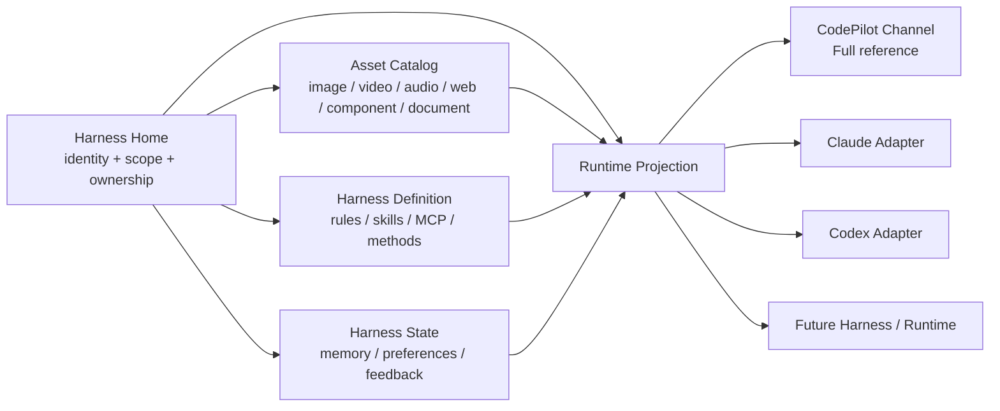
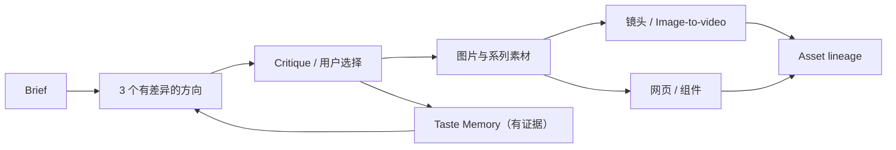

# Harness Home — 用户所有的 Harness 核心层、轻量接入与创作资产闭环

> 创建时间：2026-07-30
> 最后更新：2026-07-30
> 状态：📋 方案评审中；**当前只允许评审与事实补充，未授权产品代码实施**
> 规划基线：正式 Release `v0.62.0` tag `bd598563`；本地主目录 `main` 已规范化到该基线，旧 `main@089e4d45`（`package.json=0.58.0`）已删除

## 状态

| Phase | 内容 | 状态 | 备注 |
|-------|------|------|------|
| Phase 0 | 基线、术语、迁移源与设计方法事实锁定 | 🔄 本地 `main` 已规范化到 v0.62，待 Claude Code 评审 | 旧 divergent 0.58 分支不并入发布主线 |
| Phase 1 | Harness Home 领域契约与作用域模型 | 📋 待开始 | 与 UI、物理存储解耦；先做纯类型、纯函数与 contract tests |
| Phase 2 | 用户所有的 Canonical Repository + 无损迁移层 | 📋 待开始 | CodePilot 中立源成为事实源；外部框架目录变成 import/export adapter |
| Phase 3 | Harness Adapter Kit + Runtime Adapter Kit 分级瘦身 | 📋 待开始 | 接“配置/记忆/Skill”不再被迫接完整 Runtime |
| Phase 4 | CodePilot Channel 作为 Full Reference Channel | 📋 待开始 | 中立 Harness 在 CodePilot Runtime 中获得最完整执行能力 |
| Phase 5 | 通用 Asset Library：图片、视频、音频、网页与衍生结果 | 📋 待开始 | Artifact 是一次运行结果，Asset 是用户长期拥有的归档对象 |
| Phase 6 | CodePilot Design Method：审美方法、创作编排与反馈学习 | 📋 待开始 | 先沉淀用户真实方法，不生成一套泛化“AI 审美”冒充差异化 |
| Phase 7 | UI 入口与信息架构 | ⏸ 明确暂缓 | Harness Home 本轮是代码/领域概念，不决定放插件、设置或独立页面 |

## 用户问题、争议与本计划的回答

### 1. Harness Home 是插件页、设置页，还是别的页面？

本计划把 **Harness Home 定义为代码和领域层的聚合根**，不定义为某个页面。

- Plugin / MCP / Skill 是 Harness Home 管理的资产类型，不应反过来成为 Harness Home 的上位概念。
- Settings 适合放默认值、路径、权限、同步和诊断入口，但不适合承载 Memory、素材、网页结果和创作历史这类长期内容。
- 如果未来需要 UI，可能从 Assistant Workspace、素材库、项目页或新的一级入口进入；该选择必须建立在领域模型稳定、用户任务验证完成之后。

因此，本计划不会先造一个 “Harness Home” 页面，也不会因为名字里有 Home 就预设侧栏导航。

### 2. CodePilot 应该是什么角色？

CodePilot Channel / CodePilot Runtime 是中立 Harness 的 **Full Reference Channel**：

- 用户自己的 Memory、Skill、MCP、设计方法和素材首先属于用户；
- CodePilot Runtime 必须能最完整地读取、执行、写回和归档这些内容；
- Claude Code、Codex 和未来框架通过 adapter 获得可支持的投影；
- 对方协议没有开放的能力必须明确标为 perceptible-only / unavailable，不伪造 parity。

“CodePilot 最完整”不等于“数据锁在 CodePilot 私有数据库里”。完整执行能力和用户数据所有权必须同时成立。

### 3. 为什么接一个新 Harness / Agent 框架这么重？

当前术语把两件事混在了一起：

1. **接入外部 Harness 资产**：发现、导入、导出某个框架的 Memory、Skill、MCP、Rules。
2. **接入完整 Runtime**：运行 turn、stream event、session resume、tool call、permission、artifact。

第一类本应很轻；第二类天然更重。当前 New Runtime Playbook 把所有接入都推向第二类，且固定要求修改 RuntimeId、capability exposure、matrix、context hint、Settings、tests 和 smoke，因此第四个框架成本仍高。

本计划把二者拆成 `HarnessAdapter` 与 `RuntimeAdapter`，并提供分级接入，不再要求每个外部框架一步做到 Full Runtime。

### 4. 0.58 与正式最新版 0.62 到底是什么关系？

2026-07-30 切换前的只读核验结果：

- 当时的本地工作目录：`main@089e4d45`，`package.json=0.58.0`。
- 当时的本地 `main` 相对 `origin/main`：ahead 62 / behind 17，merge-base 为 `cc5e6fe8`；它经历过 private/public split，不是干净的发布主线。
- 同步前 GitHub `refs/heads/main` 为 `215c8f93`，只到 v0.59.1 的发布记录。
- GitHub 正式 Release 最新版为 `v0.62.0` tag `bd598563`，发布时间为 2026-07-30 04:24:33 UTC；不是 Draft 或 Pre-release。
- `v0.62.0` 是 `v0.61.0` 的直接后继，发布线可以从 v0.61 无冲突 fast-forward。

因此，“本地是 0.58”是 **worktree / branch 基线问题**，不代表已发布产品只有 0.58。用户已确认不保留那批未进入 v0.62 的本地提交；本地主目录现已切换到正式 `v0.62.0`，旧 divergent `main` 分支已删除。后续实施仍须遵守 worktree 隔离规则，不在主目录直接进行 Runtime / DB 改造。

### 5. 前一轮差距是否只是旧版本误判？

不是，但需要校正置信边界。

直接检查 `v0.61.0`，并复核 `v0.61.0..v0.62.0` 的发布增量后，确认以下关键事实仍成立：

- `RuntimeId` 仍固定为 `claude_code | codepilot_runtime | codex_runtime`。
- MCP 管理 API 仍以 `~/.claude/settings.json` / `~/.claude.json` 为主要写入面。
- Skill Marketplace 仍使用 `--agent claude-code`。
- 0.59–0.61 的 Harness 相关变化主要是 Runtime 事件、权限、Sub-agent、Provider/模型能力；v0.62 主要交付 Markdown Live Preview、Explorer 文件树与 macOS 视觉修复；没有建立中立 Harness 事实源。
- Media / Gallery 已支持图片、视频和音频归档，但尚未形成图片、视频、网页、组件、文档统一的 Asset lineage。

所以旧 worktree 让前一轮审计基线不严谨，但“用户所有权、中立适配、接入成本、创作方法”四个核心缺口在正式 v0.62 仍存在。

## 现有基础：保留并继续使用

本计划不是推倒 Phase 5d/5e。以下基础应保留：

| 现有基础 | 当前价值 | 本计划如何使用 |
|----------|----------|----------------|
| `HarnessBundle` | 已能聚合 Built-in / User / External 三层信息 | 升级为 Harness Home 的单 turn projection，不承担长期存储 |
| `Context Compiler` | 三 Runtime 统一上下文编译 | 消费 canonical Harness projection，不读取各框架私有目录 |
| Capability Contract / Matrix | 能诚实表达支持、降级和工具面 | 从固定三 Runtime exposure 迁到 descriptor 驱动 |
| Artifact Contract | 已统一 Widget / media / markdown / html 等渲染结果 | 作为 transient Artifact；持久化后转为 Asset Record |
| Canonical Runtime Events | 已减少 UI 直接理解 Runtime 私有事件 | 成为 Full Runtime adapter 的 conformance contract |
| Assistant Workspace V3 | 用户可选择路径；Memory 是纯文件 | 作为首个 canonical memory source 迁入 Harness Repository |
| Media Jobs / Gallery | 已有图片批量任务、引用和视频展示 | 演进为通用 Asset Catalog，不另造第二套 Gallery |

## 术语与边界

| 名词 | 定义 | 示例 | 明确不是什么 |
|------|------|------|--------------|
| Harness Home | 用户拥有的 Harness 聚合根；统一索引定义、状态、资产与 Runtime 投影 | “我的助理”所拥有的 Memory、Skill、MCP、设计方法和素材 | 页面、侧栏按钮、一个巨型 system prompt |
| Harness Definition | 可移植、可版本化的行为与能力定义 | identity、rules、skills、MCP descriptor、creative methods | Secret、会话临时状态 |
| Harness State | 会随使用变化的用户状态 | Memory、偏好、选择反馈、项目经验 | 模型权重、不可解释的隐藏状态 |
| Asset | 已物化、可长期归档和引用的用户产物 | 图片、视频、音频、HTML bundle、网页快照、组件、文档 | 流式半成品、任意未确认 tool output |
| Artifact | 一次运行中的结构化展示结果 | MediaBlock、inline HTML、Widget、DiffSummary | 自动等于长期 Asset |
| HarnessAdapter | 外部框架资产的发现、导入、导出和投影 | Claude/Codex/OpenCode/Hermes config adapter | 完整执行 Runtime |
| RuntimeAdapter | Agent 执行协议适配 | turn、stream、session、tool、permission、events | Provider preset |
| Creative Method | 可触发、可版本化、渐进披露的创作方法 | 设计方向生成、审稿 rubric、图转视频方法 | 塞进全局 prompt 的大段审美口号 |

## 已拍板的架构决策

### D1. Harness Home 是 Aggregate，不是巨型对象

Harness Home 只提供统一身份、索引、作用域和生命周期，不把所有内容每轮全部加载：



Context Compiler 每轮只读取与当前任务、项目、Runtime 和 token budget 相关的 projection。

### D2. 用户文件是事实源，数据库只做索引和运行态

默认方向：

- 用户可以选择 Harness root；产品也可提供默认路径，但路径不是 contract 的一部分。
- `manifest + Markdown/YAML/JSON + Skill folders + assets` 是可导出事实源。
- SQLite 可以保存索引、缓存、session 关联、全文检索和 job 状态，但不得成为唯一可读副本。
- API key、OAuth token 和其他 Secret 不进入 Harness root；manifest 只保存 `secretRef`。
- 导出后在新机器导入，除重新授权外，应恢复身份、Memory、Skill、MCP descriptor、项目 overlay、设计方法和素材索引。

说明性目录，不在 Phase 0 直接定为最终格式：

```text
<user-selected-harness-root>/
├── harness.yaml
├── identity/
├── memory/
├── skills/
├── mcp/
├── methods/
├── projects/
├── runtimes/
└── assets/
```

### D3. 作用域不以 Runtime 为中心

Canonical precedence：

```text
project overlay
  > assistant/user overlay
  > CodePilot built-in defaults
```

Runtime-specific 内容只能作为 projection overlay：

```text
runtimes/claude/
runtimes/codex/
runtimes/opencode/
```

Runtime overlay 不得反向成为公共 Memory / Skill / MCP 的权威源。

### D4. CodePilot Channel 是 Full Reference，不追求最低公分母

中立 contract 不能为了兼容最弱 Runtime 而删除能力：

- CodePilot Runtime 执行完整 canonical capabilities。
- 外部 Runtime 按自身协议投影。
- 无法投影的能力保留在 Harness Home，状态为 perceptible-only / unavailable。
- Runtime 切换不得丢失 canonical Harness 数据。

### D5. 外部接入分级

| Level | 名称 | 需要实现 | 用户得到什么 | 是否需要完整 Runtime |
|-------|------|----------|--------------|----------------------|
| L0 | Discover | 安全扫描 config / memory / skills，提供 provenance | CodePilot 知道外部 Harness 有什么 | 否 |
| L1 | Portable Projection | import/export mapping、冲突检测、canonical projection | 外部资产可在 CodePilot Runtime 使用 | 否 |
| L2 | Execution Bridge | 通过稳定 CLI/RPC 调用外部框架，映射基本 text/tool/result | 能从 CodePilot 发起外部执行 | 部分 |
| L3 | Full Runtime | session resume、stream、permission、artifacts、interrupt、usage、unknown event | 完整 Runtime 体验 | 是 |

新框架默认先评估 L0/L1。只有用户价值明确且协议稳定时才进入 L2/L3。

### D6. Artifact 与 Asset 分离

- Artifact：turn 内临时、可流式、可失败。
- Asset：已物化、有 hash、有 provenance、有稳定路径、可再次引用。
- 图片/视频生成成功后可以自动入 Asset Catalog。
- 网页结果只有在成功 materialize 为 HTML bundle / snapshot 后才入库；不得把每个 partial preview 自动归档为垃圾资产。
- Asset 必须记录 parent/derived-from，支持从参考图到图片变体、再到视频、再到网页的 lineage。

### D7. 审美方法必须可说明、可版本化、可覆盖

Creative Method 分三层：

```text
project art direction
  > user taste / learned preferences
  > CodePilot Design Method built-in pack
```

Built-in pack 是 CodePilot 的产品差异化；用户和项目 overlay 仍归用户所有。每个方法至少包含：

- 适用触发条件与目标；
- 构图、色彩、字体、材质、节奏、镜头或交互约束；
- 参考案例与反例；
- 生成步骤和 critique rubric；
- 支持的 modality；
- 版本、来源和变更说明。

方法通过 Skill / progressive disclosure 按需加载，不允许塞进每轮全局 system prompt。

## 目标领域契约

下面是 contract 方向，不是要求照抄的最终 TypeScript：

```ts
interface HarnessHomeRef {
  harnessId: string;
  rootRef: string;
  schemaVersion: number;
}

interface HarnessDefinitionIndex {
  identityRefs: AssetRef[];
  ruleRefs: AssetRef[];
  skillRefs: AssetRef[];
  mcpRefs: AssetRef[];
  creativeMethodRefs: AssetRef[];
  runtimeOverlayRefs: Record<string, AssetRef[]>;
}

interface HarnessStateIndex {
  memoryRefs: AssetRef[];
  preferenceRefs: AssetRef[];
  feedbackRefs: AssetRef[];
}

interface DurableAssetRecord {
  id: string;
  kind: 'image' | 'video' | 'audio' | 'html_bundle' | 'web_snapshot'
    | 'component' | 'document' | 'skill' | 'memory' | 'method' | 'other';
  contentRef: string;
  contentHash: string;
  scope: HarnessScope;
  provenance: Provenance;
  parentAssetIds: string[];
  createdAt: string;
}

interface RuntimeProjection {
  runtimeId: string;
  contextFragments: ContextFragment[];
  executableCapabilities: CapabilityRef[];
  perceptibleOnlyCapabilities: CapabilityRef[];
  unavailableReasons: CapabilityGap[];
  assetRefs: AssetRef[];
}
```

`Provenance` 至少包含：

- canonical / imported / generated / user-authored；
- source framework、source path 或 source session；
- Runtime、Provider、Model；
- prompt / method version / job；
- imported-at / generated-at；
- hash 与冲突状态；
- Secret 已剥离证明。

## Phase 0 — 基线、术语、迁移源与设计方法事实锁定

### 用户会看到什么变化

无产品 UI 变化。用户得到一份基于正确发布版本、可以安全交给 Claude Code 执行的事实底座。

### 本阶段明确不做

- 不切换或合并当前 divergent `main`。
- 不修改 Runtime、DB、MCP、Skill、Media 产品代码。
- 不凭空编写“CodePilot 审美方法”。
- 不决定 Harness Home UI 放在哪里。

### Claude Code 评审任务

1. 确认实施基线：
   - 使用已建立的 `codex/sync-v0.62.0` 隔离工作树；
   - 基线必须为正式 Release `v0.62.0@bd598563`；
   - 当前 `main@089e4d45` 只保留计划，不作为实施基线。
2. 对 v0.62 重新生成以下 inventory：
   - Memory 的所有读写源；
   - Skill 的发现、创建、安装、执行源；
   - MCP 的读取、写入、Runtime mount 源；
   - RuntimeId / matrix / Settings / tests 的所有 switch 和 closed union；
   - Artifact / Media / Gallery / HTML preview 的持久化边界；
   - API key / OAuth / env Secret 的所有落盘点。
3. 以“接入第四个框架”为例，统计：
   - L0/L1 Harness adapter 需要触碰的文件数；
   - 当前 L3 Runtime 接入需要触碰的文件数；
   - 其中哪些是必要协议实现，哪些只是 closed registry / duplicated switch。
4. 设计方法事实采集：
   - 阅读已有 `docs/insights/` 中与三层视觉规则、macOS profile、Artifact、Dashboard、Chat Composer 相关的决策；
   - 收集用户认可的真实作品、提示、选择和否决原因；
   - 输出 `CodePilot Design Method v0` 的素材清单和待用户确认问题；
   - 未获用户确认的内容只能标 `candidate`，不能进入 built-in pack。

### 完成标准

- 计划记录选定实施 commit。
- 每类现有资产都有 source-of-truth map。
- “第四个框架接入成本”有可复核的 touchpoint 数量。
- Design Method 输入来自真实决策/案例，不是模型自动生成的品牌文案。

## Phase 1 — Harness Home 领域契约与作用域模型

### 用户会看到什么变化

仍无新页面。现有行为不变，但代码开始拥有一套不依赖 Claude/Codex 路径的 canonical contract。

### 本阶段明确不做

- 不迁移现有用户数据。
- 不改默认 Runtime。
- 不改 MCP / Skill UI。
- 不新增 DB schema。

### 实施内容

1. 新建独立领域模块，建议边界：

```text
src/lib/harness-home/
├── contracts.ts
├── scope.ts
├── provenance.ts
├── manifest.ts
├── projection.ts
└── validation.ts
```

2. 定义：
   - Harness identity；
   - definition / state / assets 三类 index；
   - global / assistant / project / runtime-overlay scope；
   - provenance；
   - secret reference；
   - schema version；
   - RuntimeProjection。
3. 明确与现有模块的关系：
   - `HarnessBundle` = 每 turn 的 projection envelope；
   - `Capability Contract` = canonical capability catalog；
   - `Artifact Contract` = transient result rendering；
   - `Harness Home` = durable ownership / lifecycle。
4. 增加纯 contract tests：
   - precedence；
   - manifest parse / reject；
   - provenance required fields；
   - secret material 不可序列化；
   - unknown runtime overlay 保留、不丢弃；
   - unsupported capability 保留原因。

### 完成标准

- Contract 中没有 `.claude` / `.codex` 路径。
- Contract 中没有固定三 Runtime 的 record key。
- 未注册 Runtime 的 overlay 能 round-trip。
- Secret 明文进入 export model 时测试 fail-closed。
- 现有 Runtime 和 UI 行为零变化。

## Phase 2 — Canonical Repository 与无损迁移层

### 用户会看到什么变化

首轮可通过内部 diagnostics / CLI fixture 验证：CodePilot 能构建一份用户自己的 Harness manifest，并预览从旧来源导入什么；不要求 UI 上线。

### 本阶段明确不做

- 不删除或移动用户现有 `.claude` / `.codex` 文件。
- 不自动覆盖外部框架配置。
- 不把 Secret 复制进 Harness root。
- 不在迁移成功前停用旧 loader。

### 实施内容

1. 定义 `HarnessRepository` 接口，默认实现为用户可选择根目录的 file repository。
2. SQLite 只保存：
   - repository registry；
   - content hash / search index；
   - session / job / asset 关联；
   - migration journal；
   - 不可作为 identity / memory / skill / method 的唯一副本。
3. 实现 source adapters：
   - Assistant Workspace；
   - Claude Code：settings、skills、commands、rules；
   - Codex：config、skills、prompts/instructions；
   - CodePilot 当前 DB 中的 provider-independent MCP metadata；
   - 现有 Gallery / media records。
4. 迁移必须是：
   - dry-run first；
   - copy / reference，不删除源；
   - 显示来源 breadcrumb；
   - content hash 去重；
   - 同名不同内容进入 conflict，不静默覆盖；
   - journal 可重跑、可恢复；
   - 失败不影响旧路径继续工作。
5. 过渡期 dual-read：
   - canonical repository 优先；
   - 旧来源作为 compatibility source；
   - 所有返回项标 source；
   - 达到迁移门禁后再讨论旧写路径降级。

### 完成标准

- 可从 fixture 生成完整 manifest。
- 重复迁移 idempotent。
- 同名冲突不丢内容。
- 原目录字节级不变。
- 导出包扫描不到 API key、OAuth token、authorization header。
- 在干净临时目录导入后，identity / memory / skill metadata / MCP descriptor / methods 可恢复。

## Phase 3 — Adapter Kit 分级瘦身

### 用户会看到什么变化

用户暂时不一定看到新 Runtime，但团队接一个外部框架时可以先交付“识别和迁移”，不再被迫完成完整聊天 Runtime。

### 本阶段明确不做

- 不承诺任意框架自动成为 Full Runtime。
- 不为了减少代码量而弱化 permission / session / artifact contract。
- 不通过读取对方 auth 文件绕过协议。

### 3A. HarnessAdapter Kit

一个 L0/L1 adapter 应只实现：

```ts
interface HarnessAdapter {
  descriptor: HarnessAdapterDescriptor;
  discover(input: DiscoverInput): Promise<DiscoveredHarnessAssets>;
  importPlan(input: ImportInput): Promise<ImportPlan>;
  exportPlan?(input: ExportInput): Promise<ExportPlan>;
  project(input: ProjectionInput): Promise<HarnessProjectionOverlay>;
}
```

目标目录：

```text
src/lib/harness-home/adapters/<framework-id>/
├── descriptor.ts
├── discover.ts
├── import.ts
├── export.ts
└── fixtures/
```

L0/L1 成功门禁：

- 新 adapter 不修改现有 adapter。
- 不修改 Settings capability list。
- 不修改 Context Compiler 分支。
- 不修改 Artifact renderer。
- 只需 descriptor 注册 + adapter 自身代码/fixture。

### 3B. RuntimeAdapter Kit

Full Runtime 保留严格 contract，但把注册和 capability exposure 改为 descriptor 驱动：

```ts
interface RuntimeDescriptor {
  id: string;
  displayName: string;
  integrationLevel: 'bridge' | 'full';
  capabilities: RuntimeCapabilityDeclaration[];
  harnessProjectionModes: ProjectionMode[];
  session: SessionDriver;
  events: EventMapper;
  permissions: PermissionMapper;
  artifacts: ArtifactSupportDeclaration[];
}
```

实施前必须 POC：

- `RuntimeId` 从 closed union 迁到 registered/validated opaque id 的影响；
- DB wire compatibility；
- i18n / Settings 自动派生；
- capability matrix 从 descriptor 生成；
- unknown runtime fail-closed；
- packaged Electron 中的显式注册方式。

本计划不要求“运行时任意加载第三方 JS 插件”。首轮可以是编译期 descriptor registry，只要新增 adapter 不再修改多处 switch。

### Conformance Suite

每个 Full Runtime adapter 自动运行：

1. descriptor completeness；
2. context projection；
3. executable = truly mounted；
4. unsupported reason；
5. tool start/result pairing；
6. permission mapping；
7. session resume；
8. interrupt / terminal state；
9. artifact round-trip；
10. unknown event preservation；
11. asset materialization；
12. external Harness perception；
13. secret isolation。

### 完成标准

- 新增 L0/L1 framework 只触碰 adapter 目录、注册表和测试 fixture。
- 对使用现有 canonical capability/artifact 的新 Full Runtime，不修改既有 adapter、Context Compiler、Settings capability component 和 Artifact renderer。
- Capability matrix 由 descriptor 派生，不逐 cell 手填第四份。
- Playbook 从“固定修改多处文件”改成“选择 Level → 实现 descriptor → 跑 conformance”。

## Phase 4 — CodePilot Channel 作为 Full Reference Channel

### 用户会看到什么变化

用户在 CodePilot Runtime 下使用 canonical Memory、Skills、MCP、Creative Methods 和 Assets 时获得最完整能力；切换外部 Runtime 时，能力差异不会造成数据丢失。

### 本阶段明确不做

- 不要求 Claude/Codex 立即达到 100% parity。
- 不把 Claude-specific commands 当 canonical Skill。
- 不用 prompt 宣称未 mount 的工具可用。

### 实施内容

1. Native / CodePilot Runtime 从 canonical repository 读取：
   - identity / rules；
   - memory；
   - Agent Skills；
   - MCP descriptors；
   - creative methods；
   - asset references。
2. Skills：
   - canonical 使用 Agent Skills directory contract；
   - 当前 `.claude/commands` 作为兼容导入源；
   - parser 通过标准 fixtures；
   - inline / fork / script / references / assets 的执行语义有真实测试。
3. MCP：
   - canonical neutral descriptor；
   - secretRef 在执行时解析；
   - runtime projection 生成 Claude/Codex 所需配置；
   - 不再默认把 CodePilot 新建 MCP 写入 `.claude/settings.json`。
4. Memory：
   - 相同 canonical memory 在三 Runtime projection 中有一致 source breadcrumb；
   - Runtime 私有 memory 作为 overlay，不覆盖公共事实源。
5. 修复已知 contract drift：
   - scanner 声称 Skill 不可执行但 Native 实际挂载 Skill Tool；
   - external scanner 与真实框架目录不一致；
   - capability catalog 未完整表达 user skills。

### 完成标准

- CodePilot Runtime 对 canonical identity / memory / skills / MCP / methods / assets 的 coverage 为 Full。
- 运行时切换不改写 canonical 数据。
- Runtime 不支持某能力时，UI/model 获得同一个明确原因。
- 新建 Skill / MCP 默认写 canonical repository；外部 export 是用户明确动作。

## Phase 5 — 通用 Asset Library

### 用户会看到什么变化

素材库不再只像“图片 Gallery”：图片、视频、音频、生成网页、组件和文档结果可以在同一项目脉络中归档、查找、继续创作。

### 本阶段明确不做

- 不归档每个流式 token 或 partial HTML。
- 不复制一份与现有 Gallery 无关的新 UI。
- 不在没有 CSP/trust 信息时把 HTML 当安全静态文件打开。

### 实施内容

1. 在现有 `media_generations` / `media_jobs` / Gallery 基础上设计通用 `AssetRecord`，先做 DB migration plan 和 backfill，不直接替换旧表。
2. 支持 kind：
   - image；
   - video；
   - audio；
   - html_bundle；
   - web_snapshot；
   - component；
   - document；
   - other。
3. 记录：
   - stable content path / hash；
   - MIME / dimensions / duration / preview；
   - Harness / project / session / turn；
   - Runtime / Provider / Model；
   - prompt / reference / method version；
   - parent / derived-from；
   - user rating / selected / rejected；
   - trust / CSP / source scope；
   - license / source URL（如适用）。
4. Artifact → Asset materialization：
   - generated image/video 成功后自动 materialize；
   - imported file 通过现有安全边界入库；
   - HTML / web result 只有在完整生成、通过 trust 分类、写入稳定 bundle 后 materialize；
   - failure / partial 只留 run log。
5. Asset 可作为后续 turn 的 typed reference，不靠模型猜本地路径。

### 完成标准

- 现有 Gallery 数据无损 backfill。
- 一条 image → derived image → video → webpage 链路可追溯。
- 同一 Asset 可被 CodePilot、Claude、Codex projection 引用；不支持直接 media input 的 Runtime 获得明确降级。
- 删除 Asset 前能展示引用关系；默认走可恢复删除。
- HTML Asset 保留 Phase 4 Artifact 的 trust / CSP / scope 契约。

## Phase 6 — CodePilot Design Method

### 用户会看到什么变化

CodePilot 不只是能调用图片/视频模型，而是能按照一套可识别的方法完成：理解 brief、形成方向、生成素材、审稿、迭代、转视频、落网页，并逐渐理解用户的审美选择。

### 本阶段明确不做

- 不先做一个大而全节点画布去正面复制 Krea / FLORA。
- 不把“高级、优雅、电影感”等空泛词当方法。
- 不把用户每次选图都自动推断为永久偏好。
- 不在缺少用户确认时修改 built-in method pack。

### 6A. Method Pack

首个版本至少覆盖：

1. Brief clarification；
2. Reference decomposition；
3. 多方向而非同 prompt 换 seed；
4. 视觉层级、构图、色彩、字体与材质检查；
5. 图片一致性与系列化；
6. Image-to-video 镜头/运动规划；
7. 网页信息架构与视觉实现；
8. Critique / compare / select / revise；
9. 输出到 Asset lineage。

每个 method 有 machine-readable metadata 和人类可读正文，遵循 progressive disclosure。

### 6B. Taste Memory

只记录有证据的偏好：

- 用户明确说出的偏好；
- 用户在多个方向中选择/否决的结果；
- 用户给出的修改原因；
- 项目级 art direction。

写入前区分：

- one-off decision；
- project preference；
- durable user preference；
- CodePilot built-in principle。

关键偏好需要来源、时间和可撤销性，不能形成不可解释的“隐藏审美画像”。

### 6C. Creative Orchestration

参考流程：



模型路由是方法的一部分，但 Method 不绑定单一模型。Runtime 和 Provider 可切换，资产、方法和选择历史不丢失。

### 完成标准

- 选定 3–5 个真实 creative briefs 作为 golden set。
- 同一 brief 输出的方向具有可解释差异，不是同 prompt 换 seed。
- 每次 critique 都能引用具体 method criterion。
- 用户选择与修改原因可写入、查看、撤销。
- 图片、视频、网页结果全部进入同一 lineage。
- 切换 Runtime / Provider 后能继续同一 creative project。
- 用户确认首版 CodePilot Design Method 确实包含其方法，而不是通用 AI 设计建议。

## Phase 7 — UI 入口与信息架构（暂缓）

等 Phase 1–6 的领域对象和用户任务稳定后再做。

届时至少比较：

| 方案 | 优点 | 风险 |
|------|------|------|
| 放 Plugins | 延续 MCP/Skill 心智 | Memory、素材、网页和方法被错误理解为插件 |
| 放 Settings | 易于配置与诊断 | 长期内容被藏进设置；不适合高频创作 |
| 放 Assistant Workspace | 与身份/Memory 接近 | 素材库和项目创作可能过重 |
| 独立一级入口 | 能承载全量 Harness / Assets / Projects | 过早增加导航和产品概念 |
| 多入口同一领域对象 | 用户从 Settings/Assistant/Gallery 各自进入相关任务 | 需要稳定路由和一致信息架构 |

本计划当前推荐：**领域上统一，UI 上多入口；是否出现独立 Harness Home 页面由后续用户研究决定。**

## 迁移与兼容原则

1. 迁移不删数据。
2. 外部框架目录默认只读发现；写回必须是显式 export。
3. canonical 与 external 的冲突必须可见。
4. schema migration 支持 rollback / restart。
5. 旧版本启动新 DB 时不应损坏 Harness files。
6. large assets 采用 hash/index，不在 manifest 内嵌 base64。
7. Secret 与 portable data 分离。
8. imported asset 保留 source breadcrumb。
9. runtime-specific opaque session ref 不写进可移植公共定义；只进入 runtime state overlay。

## 主要风险与防线

| 风险 | 后果 | 防线 |
|------|------|------|
| Harness Home 变成万能 God Object | 所有模块重新耦合 | definition/state/assets/projection 四域分离；接口只传 ref/index |
| 为跨 Runtime 取最低公分母 | CodePilot 优势消失 | Full Reference Channel + explicit degradation |
| 新 adapter 仍修改十几个 switch | 接入成本未下降 | descriptor 派生 + touchpoint acceptance test |
| 把外部 config 复制后静默漂移 | 用户不知道哪份生效 | provenance、hash、conflict、explicit export |
| Secret 进入导出包 | 严重安全事故 | SecretRef + export scanner + fail-closed tests |
| Asset Library 另造第二套 Gallery | 数据与 UI 双轨 | 复用现有 media pipeline，先 backfill 再扩 kind |
| HTML/网页归档绕过安全模型 | 本地数据泄漏 / 任意脚本 | 沿用 Artifact trust/CSP/scope；仅 materialized bundle 入库 |
| 审美方法泛化为宣传话术 | 失去差异化且不可验收 | 真实案例、反例、rubric、版本、用户确认、golden set |
| Taste Memory 过度推断 | 用户失去控制 | evidence + scope + editable + forget |
| 在错误分支实施 | 计划与发布代码错位 | Phase 0 先选 tag/branch + 隔离 worktree |

## 总体验收场景

### A. 用户所有权

1. 在 CodePilot 创建 Skill、MCP descriptor、Memory 和 Creative Method。
2. 导出 Harness。
3. 在干净环境导入。
4. 重新授权 Secret。
5. 恢复同一 identity、能力、Memory、方法和素材索引。

### B. Runtime 切换

1. 同一项目在 CodePilot Runtime 开始。
2. 切换 Claude / Codex。
3. Canonical Memory 与 Assets 不丢。
4. Runtime 不支持项有明确原因。
5. 切回 CodePilot 后继续完整执行。

### C. 轻量接入第四个框架

1. 先实现 L0 Discover。
2. 再实现 L1 Portable Projection。
3. 不修改现有 Runtime adapter、Context Compiler、Settings capability component、Artifact renderer。
4. 用户已经能导入其 Memory / Skills / MCP。
5. 只有确认需要时才进入 L2/L3。

### D. 创作闭环

1. 输入真实 Brief。
2. 调用 CodePilot Design Method 形成多个可解释方向。
3. 生成并选择图片。
4. 由选择结果生成视频与网页/组件。
5. 素材库展示完整 parent/derived-from。
6. 用户撤销一条 Taste Memory 后，后续 projection 不再注入。

## 验证分层

| 层 | 内容 |
|----|------|
| Tier 0 | manifest/schema/scope/provenance/secret scan/adapter descriptor 纯测试 |
| Tier 1 | repository、migration、dual-read、capability projection、asset lineage、contract suite |
| Tier 2 | DB migration、三 Runtime 真凭据、permission、session resume、interrupt、图片/视频/HTML materialization、Electron packaged smoke |
| Human visual gate | Design Method golden set、网页结果、图片系列、视频节奏；必须由用户看真实结果，不以 snapshot 单独代替 |

## Smoke Ledger（真实凭据 / UI / E2E 验证记录）

> 跑了真实 smoke 后必须在这里登记。不得把“类型测试通过”写成“跨 Runtime 已完成”。

| Date | Runtime | Provider | Model | 凭据形态 | 场景 | Result | Evidence |
|------|---------|----------|-------|---------|------|--------|----------|
| _示例_ | codepilot_runtime | OpenRouter | model-under-test | API key | canonical Harness import → skill/MCP/memory → asset materialization | ⏳ | session id / asset ids / screenshot |

## 决策日志

- 2026-07-30：用户确认 Harness Home 可以是与 UI 无关的抽象概念；因此先规划领域层，不决定放 Plugins、Settings 或独立页面。
- 2026-07-30：CodePilot Channel 继续作为最完整渠道，但完整能力不能以数据锁定为代价。
- 2026-07-30：素材库范围扩大到图片、视频、音频、网页结果和其他可物化产物；采用 Artifact → Asset materialization，避免把流式半成品全部归档。
- 2026-07-30：用户指出接新 Harness 太重。计划拆分 HarnessAdapter 与 RuntimeAdapter，并采用 L0–L3 分级；接外部配置/记忆/Skill 不再被迫做完整 Runtime。
- 2026-07-30：用户指出其独特审美和方法尚未进入产品。计划建立 CodePilot Design Method + user/project overlay；Phase 0 先采集真实方法和案例，不由 AI 凭空生成。
- 2026-07-30：核验发现当时工作目录的 0.58 是分支/发布基线问题；不把有大量双边改动和冲突的旧 `main` 原地合并到发布线。
- 2026-07-30：首次读取 GitHub Releases 页面时受缓存/不完整结果影响，错误判断 v0.62.0 尚未正式发布。随后通过 GitHub Release API 确认 `v0.62.0` 已于 2026-07-30 04:24:33 UTC 正式发布，且非 Draft / Pre-release。
- 2026-07-30：用户确认未进入 v0.62 的旧 0.58 本地提交不再保留。本地主目录已切换到 `v0.62.0@bd598563`，旧 `main@089e4d45` 分支删除，临时同步 worktree 移除，并由 v0.62 基线重新建立本地 `main`；远端只在本地测试与构建通过后同步。
