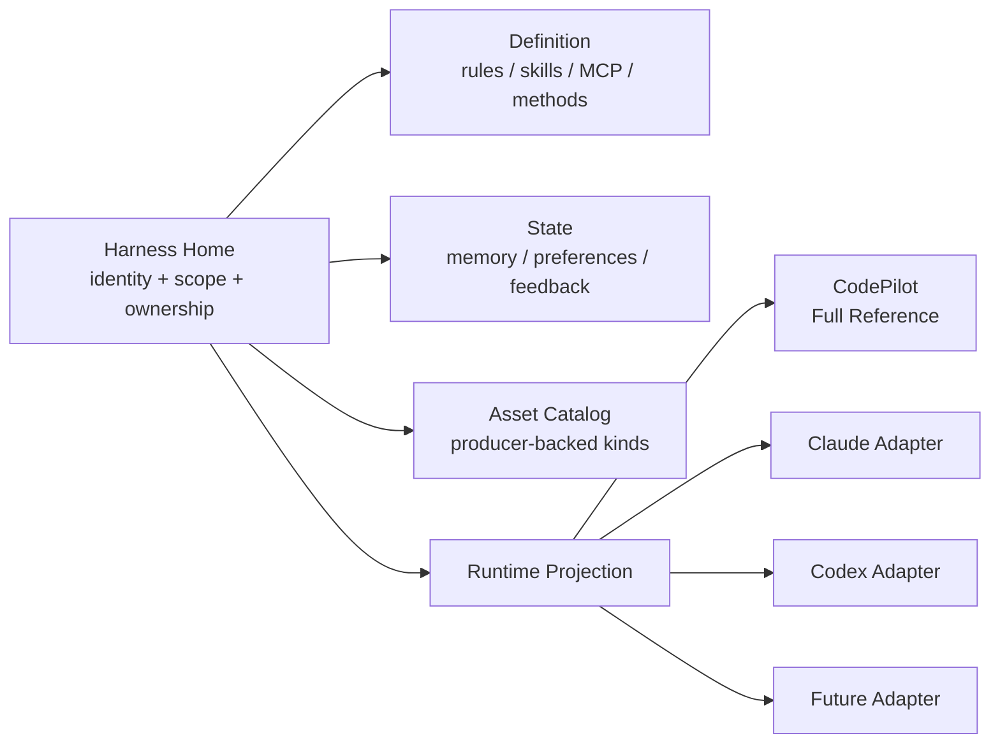
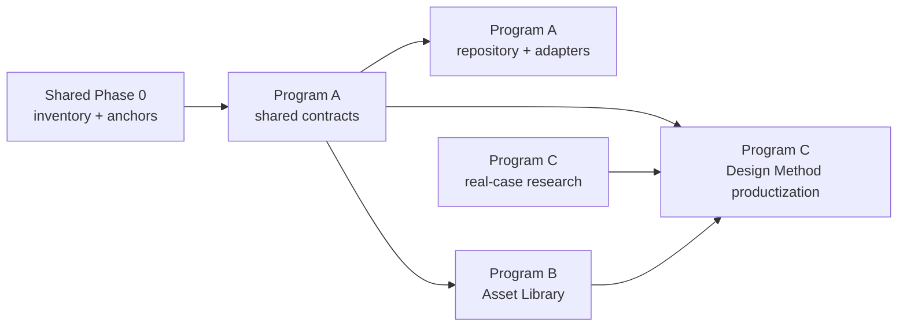

# Harness Home Umbrella — 用户所有的 Harness、轻量接入与创作闭环

> 创建时间：2026-07-30
> 最后更新：2026-07-31
> 状态：🔄 Shared Phase 0 与 Program A/B/C foundation 已实现并完成 Claude review hardening；真实凭据、packaged app 与 Design Method human gates 仍开放
> 规划基线：正式 Release `v0.62.0` tag `bd598563`；本地与远端 `main` 已规范化到 v0.62 发布线
> 文档职责：只维护共享定义、跨计划依赖、Phase 0 门禁和用户决策；各 program 的实施状态与 Smoke Ledger 以子计划为准

## Program 状态

| Program | 内容 | 状态 | 权威计划 |
|---------|------|------|----------|
| Shared Phase 0 | 基线、事实 inventory、enforcement anchors 与跨计划 contract 边界 | ✅ 完成；见 `docs/research/harness-home-v0.62-inventory-2026-07-30.md` | 本文件 |
| Program A | Harness Core、Canonical Repository、Harness/Runtime Adapter | 🟡 A1–A4 code/tests + review hardening 完成；真实凭据 Tier 2 smoke 待最终验收 | [harness-home-core-adapters.md](harness-home-core-adapters.md) |
| Program B | 通用 Asset Library、materialization 与 lineage | 🟡 B0–B3 code/tests + 真实本地 Browser UI smoke + review hardening 完成；packaged app / 用户 human gate 待最终验收 | [harness-home-asset-library.md](harness-home-asset-library.md) |
| Program C | CodePilot Design Method、Taste Memory 与创作编排 | 🟡 C0 候选证据清单 + C1/C2/C3 foundation/API/tests 完成；真实 Method/golden producer/human gate 待用户 | [harness-home-design-method.md](harness-home-design-method.md) |
| Deferred UI | Plugins / Settings / Workspace / 独立入口的信息架构 | ⏸ 明确暂缓 | 本文件只保留候选方案与用户决策 |

## 实施 commit 映射

| 范围 | Commit |
|------|--------|
| Program A contracts/repository/adapters/runtime foundation | `6f02130e`、`59748101`、`7d2dc871`、`f80512fe` |
| Program B Asset index / HTML materializer / Gallery foundation | `caf64001`、`6131ad92`、`c64c598c`、`bf6f913c` |
| Program C Method / Taste / creative-project foundation | `a54aad4b` |
| Asset Library UI 多轮用户反馈收口 | `dcf40d7f`、`b8115101`、`41924589`、`2b3a9a14`、`300f4904` |
| Claude review + Codex duplicate media + boundary/build hardening | `ef396b0d` |
| Review follow-up：journal/Taste poison 韧性与 link/Codex 实走 | `fb77d434` |

## 用户问题与共享回答

### Harness Home 是页面吗？

不是。Harness Home 是代码和领域层的聚合根：

- Plugin / MCP / Skill 是 Harness Home 管理的资产类型，不是上位概念。
- Settings 适合默认值、路径、权限、同步和诊断，不适合承载 Memory、素材和创作历史。
- UI 未来可以从 Assistant Workspace、素材库、项目页或独立入口进入同一领域对象。
- 本轮不因为名称里有 “Home” 就预设侧栏页面。

因此当前选择是：**领域上统一，UI 上多入口；是否建立独立 Harness Home 页面由后续用户研究决定。**

### CodePilot 是什么角色？

CodePilot Runtime 是稳定 canonical capability 的 **Full Reference Implementation**：

- 用户的 Memory、Skill、MCP、设计方法和素材首先属于用户。
- Stable canonical capability 必须在 CodePilot Runtime 可执行，并通过对应 conformance suite。
- Canonical catalog 可以先出现 `draft + referenceStatus=pending` 的能力提案，但不得作为稳定能力或用户承诺。
- Claude Code、Codex 和未来框架通过 adapter 获得自身协议支持的投影。
- 不支持项必须是 perceptible-only / unavailable，并携带明确原因，不伪造 parity。

核心约束：

```text
stable canonical capabilities ⊆ CodePilot executable capabilities
```

外部 Runtime 独有能力可以保留为 runtime overlay，也可以进入 draft canonical 评估。Full Reference 是“通过 conformance 的参照实现”，不是“canonical 永远不能领先 CodePilot”，也不是把数据锁进 CodePilot 私有数据库。

### 为什么接新 Harness 太重？

当前实现混合了两类工作：

1. 外部 Harness 资产接入：发现、导入、导出 Memory、Skill、MCP、Rules。
2. 完整 Runtime 接入：turn、stream、session、tool、permission、artifact、interrupt。

Program A 把二者拆成 `HarnessAdapter` 与 `RuntimeAdapter`，采用 L0–L3 分级：

| Level | 名称 | 用户价值 | 是否需要完整 Runtime |
|-------|------|----------|----------------------|
| L0 | Discover | 安全发现外部 config / memory / skills，并保留 provenance | 否 |
| L1 | Portable Projection | import/export、冲突检测、canonical projection | 否 |
| L2 | Execution Bridge | 通过稳定 CLI/RPC 发起基本执行 | 部分 |
| L3 | Full Runtime | session、stream、permission、artifact、interrupt、usage | 是 |

新框架默认先评估 L0/L1，只有用户价值明确且协议稳定时才进入 L2/L3。

## v0.62 事实底座

2026-07-30 已在正式 `v0.62.0@bd598563` 复核：

- `RuntimeId` 仍固定为 `claude_code | codepilot_runtime | codex_runtime`。
- MCP 管理 API 仍以 `~/.claude/settings.json` / `~/.claude.json` 为主要写入面。
- Skill Marketplace 仍使用 `--agent claude-code`。
- `HarnessBundle` / Context Compiler 已存在，但没有中立、用户所有的 durable Harness repository。
- Media / Gallery 已支持图片、视频和音频归档，但没有统一、producer-backed 的 Asset kind registry 与 lineage contract。
- v0.62 没有改变上述 Harness 所有权、中立适配、接入成本和创作方法缺口。

历史说明：

- 切换前本地 `main@089e4d45` 为 0.58 divergent worktree，ahead 62 / behind 17，merge-base `cc5e6fe8`。
- 用户确认不把未进入 v0.62 的旧线作为产品事实源；本地与远端 `main` 已同步到 v0.62 发布线。
- 旧 0.58 历史仍可由其他本地恢复分支持有，但不能再被下一个执行者当作实施基线。
- 后续产品实现必须从当前 v0.62 `main` 新建隔离 worktree，不在主目录直接做 Runtime / DB 改造。

## 共享领域决策

### D1. Harness Home 是 Aggregate，不是 God Object

Harness Home 只提供统一身份、索引、作用域和生命周期：



Context Compiler 每轮只读取与当前任务、项目、Runtime 和 token budget 相关的 projection。

### D2. 用户文件是事实源，数据库只做索引和运行态

- `manifest + Markdown/YAML/JSON + Skill folders + assets` 是可导出事实源。
- SQLite 可以保存索引、缓存、session/job 关联、全文检索和 journal，但不能成为 identity、memory、skill、method 的唯一副本。
- Secret 不进入 Harness root；manifest 只保存 `secretRef`。
- 换机导入除重新授权 Secret 外，应恢复同一 identity、Memory、Skill、MCP descriptor、project overlay、method 和 asset index。
- 日常写模型不是实现细节：单写者、锁、事务写、崩溃恢复、外部编辑和多实例冲突必须在 Program A 开工前拍板。

### D3. 作用域不以 Runtime 为中心

```text
project overlay
  > assistant/user overlay
  > CodePilot built-in defaults
```

Runtime-specific 内容只作为 projection overlay，不得反向成为公共 Memory / Skill / MCP 的权威源。

### D4. Full Reference 允许 draft 领先，但稳定能力必须可执行

`referenceStatus` 只有：

- `pending`：draft capability，尚未完成 CodePilot mount / conformance；
- `executable`：真实 mount、contract tests、smoke evidence 已完成；
- `rejected`：决定不进入 canonical，保留为 runtime overlay 或移除。

从 draft 升 stable 必须满足 `referenceStatus=executable`。Settings、模型上下文和 UI 不得把 `pending` 显示为可用。

### D5. Artifact 与 Asset 分离

- Artifact 是 turn 内临时、可流式、可失败的结果。
- Asset 是已物化、有 hash/provenance/稳定路径、可再次引用的长期对象。
- 只有 producer-backed kind 才能进入 Asset registry。
- HTML 只有完整生成、通过 trust/CSP 分类并写入稳定 bundle 后才成为 Asset。
- `component` / `document` 在没有真实 materializer、validator 和 consumer 前只属于候选设计，不进入首版 schema 或 UI。

### D6. Creative Method 必须可说明、可版本化、可覆盖

```text
project art direction
  > user taste / learned preferences
  > CodePilot Design Method built-in pack
```

方法必须包含触发条件、步骤、案例/反例、critique rubric、版本和来源；通过 Skill / progressive disclosure 按需加载，不进入每轮全局 prompt。Taste Memory 只记录有证据、可查看、可撤销的偏好。

### D7. Secret 与 portable data 分离

- `secretRef` 只标识用途和解析 key，不携带 Secret 明文。
- Shared Phase 0 必须盘点现有 DB、OAuth settings、env 和外部框架 credential 读取面。
- Program A 开工前必须选定 `SecretStore` abstraction、resolver、换机 unresolved 行为、撤销/清理和日志脱敏边界。
- 未完成 SecretStore 决策前，不允许实现 export/import 写路径。

## 共享 contract 方向

下面是边界草图，不是要求照抄的最终 TypeScript：

```ts
interface HarnessHomeRef {
  harnessId: string;
  rootRef: string;
  schemaVersion: number;
}

interface HarnessDefinitionIndex {
  identityRefs: AssetRef[];
  ruleRefs: AssetRef[];
  skillRefs: AssetRef[];
  mcpRefs: AssetRef[];
  creativeMethodRefs: AssetRef[];
  runtimeOverlayRefs: Record<string, AssetRef[]>;
}

interface HarnessStateIndex {
  memoryRefs: AssetRef[];
  preferenceRefs: AssetRef[];
  feedbackRefs: AssetRef[];
}

type AssetKindId = string;

interface DurableAssetRecord {
  id: string;
  kind: AssetKindId;
  producerId: string;
  contentRef: string;
  contentHash: string;
  scope: HarnessScope;
  provenance: Provenance;
  parentAssetIds: string[];
  createdAt: string;
}

interface CanonicalCapabilityRef {
  id: string;
  maturity: 'draft' | 'stable';
  referenceStatus: 'pending' | 'executable' | 'rejected';
}

interface RuntimeProjection {
  runtimeId: string;
  contextFragments: ContextFragment[];
  executableCapabilities: CapabilityRef[];
  perceptibleOnlyCapabilities: CapabilityRef[];
  unavailableReasons: CapabilityGap[];
  assetRefs: AssetRef[];
}
```

`AssetKindId` 由 Program B 的 producer-backed registry 校验，不是“任意字符串都算支持”。`Provenance` 至少包含 source kind/path/session、Runtime、Provider、Model、prompt/method/job、时间、hash、conflict 和 Secret 已剥离证明。

## Shared Phase 0 — 事实与门禁

### 当前实施授权

2026-07-30 用户明确授权 Codex 按本计划直接实施，并明确要求不启动 loop。实施必须在隔离 worktree 进行；push、merge、release 仍未授权。

### Inventory

- Memory 的全部读写源；
- Skill 的发现、创建、安装、执行源；
- MCP 的读取、写入、Runtime mount 源；
- RuntimeId / matrix / Settings / tests 的 closed union 和 switch；
- Artifact / Media / Gallery / HTML preview 的持久化边界；
- API key / OAuth / env Secret 的落盘点、读取者、脱敏出口和生命周期；
- 当前每个可物化 Asset kind 的 producer、materializer、validator、preview/consumer 与持久化位置；
- 以“第四个框架”为例的 L0/L1 与 L3 touchpoint 数量。

### Enforcement Anchor Ledger

以下是 v0.62 已观察闭合点，不等于已经 enforcing。Program A Phase A1 开工前，D1–D7 和 L0/L1 边界必须逐条补齐“当前 file+symbol、目标 enforcing file+symbol、检验方式”。

| 约束面 | v0.62 已观察 file + symbol | 必须补齐的 enforcement | 状态 |
|--------|----------------------------|------------------------|------|
| Runtime ID 闭合联合 | `src/lib/runtime/runtime-id.ts:RUNTIME_IDS / isRuntimeId` | registered opaque id validation；未知 id fail-closed | observed |
| MCP Claude-centric 写入 | `src/app/api/plugins/mcp/route.ts:GET / PUT / POST` | canonical write 与 explicit export contract tests | observed |
| Marketplace target 硬编码 | `src/app/api/skills/marketplace/install/route.ts:POST` | neutral target descriptor + per-target conformance | observed |
| Harness turn projection | `src/lib/harness/harness-bundle.ts:buildHarnessBundle` | canonical repository → projection equivalence tests | observed |
| Context 编译 | `src/lib/harness/context-compiler.ts:compileContext` | 新 framework 不新增 compiler branch 的 source-pin test | observed |
| Capability matrix / Settings | `src/lib/harness/capability-matrix.ts:capabilityMatrixForRuntime / capabilityMatrixForRuntimeProvider`；`src/components/settings/RuntimeCapabilityList.tsx:RuntimeCapabilityList` | descriptor-derived coverage + no duplicated cell test | observed |
| Artifact contract / renderer | `src/lib/harness/artifact-contract.ts:ARTIFACT_CONTRACTS / getArtifact`；`src/components/ai-elements/artifact.tsx:Artifact*` | L0/L1 adapter 不得修改 renderer 的 boundary check | observed |
| 既有 hardcoding guard | `src/__tests__/unit/runtime-id-hardcoding.test.ts` | 扩展为 adapter touchpoint / import-boundary guard | partial |

可接受的检验方式：

- 纯 contract / conformance test；
- source-pin / import-boundary test；
- 带明确 base commit 与 allowlist 的 changed-files guard；
- packaged smoke 或人工视觉门禁（只用于无法静态验证的行为）。

Changed-files guard 不得默认为本地 `HEAD~1`；例外文件必须逐项说明理由。

### 开工前必须拍板

1. File repository write model：
   - 单写者和锁粒度；
   - staging + journal + atomic rename；
   - 崩溃恢复与半写检测；
   - `fs.watch` 只作提示，hash/rescan 才是对账事实；
   - 主目录、worktree 和多实例争用时的只读/接管行为。
2. SecretStore：
   - 存储介质与 resolver；
   - `secretRef` schema；
   - 换机 unresolved、重新授权、撤销与清理；
   - export/log/diagnostics 脱敏。
3. L0/L1 touchpoint budget：
   - 基线文件数；
   - 允许目录；
   - 例外审批；
   - 自动化回归方式。
4. Producer-backed Asset kind registry 初始清单。

### 完成标准

- [x] 实施基线锁定为正式 v0.62 发布线。
- [x] 每类 Harness 资产有 source-of-truth map。
- [x] 第四个框架的 L0/L1 与 L3 touchpoint 有可复核数字。
- [x] D1–D7、L0/L1 和 Full Reference 规则有 enforcing file+symbol 与检验方式。
- [x] File write model 已覆盖单写者、原子性、外部编辑与多实例。
- [x] SecretStore 与 `secretRef` 的解析/换机行为已拍板。
- [x] Producer-backed Asset kind inventory 完成；无 producer 的 kind 不进入 registry。
- [x] Design Method 事实输入只接受真实决策/案例；现有 macOS profile 可作工程事实，built-in method/golden set 仍保留用户人工门禁。

## Program 依赖与并行边界



- Program C 的真实案例采集已从四组既有产品决策建立 candidate 清单；用户已授权 foundation 产品代码实施，但通用方法归属仍保留用户确认门禁。
- Program B 只依赖 Program A 的 `AssetRef`、scope、provenance 和 repository boundary，不依赖完整 RuntimeAdapter。
- Program C 产品化依赖共享 scope/provenance；创作 lineage 功能依赖 Program B。
- 三个 program 各自维护状态、验收和 Smoke Ledger；Umbrella 不复写执行进度。

## UI 入口（明确暂缓）

| 方案 | 优点 | 风险 |
|------|------|------|
| 放 Plugins | 延续 MCP/Skill 心智 | Memory、素材、网页和方法被误解为插件 |
| 放 Settings | 易配置和诊断 | 长期内容被藏进设置 |
| 放 Assistant Workspace | 与身份/Memory 接近 | 素材和项目创作可能过重 |
| 独立一级入口 | 可承载 Harness / Assets / Projects | 过早增加导航概念 |
| 多入口同一领域对象 | 各任务从自然位置进入 | 需要稳定路由与一致信息架构 |

当前只拍板领域统一，不拍板页面。

## 总体验收场景

### 用户所有权

创建 Skill、MCP descriptor、Memory 和 Method → 导出 Harness → 干净环境导入 → 重新授权 Secret → 恢复同一身份、能力、Memory、方法与 Asset index。

### Runtime 切换

同一项目在 CodePilot 开始 → 切换 Claude/Codex → canonical Memory 与 Assets 不丢 → 不支持项有明确原因 → 切回 CodePilot 继续完整执行。

### 轻量接入第四个框架

L0 Discover → L1 Portable Projection → 通过 per-adapter conformance → 不修改现有 adapter、Context Compiler、Settings capability component 或 Artifact renderer → 只有用户价值明确时进入 L2/L3。

### 创作闭环

真实 Brief → 多个可解释方向 → 图片/视频/网页 materialization → Asset lineage → 有证据的 Taste Memory → 可查看、撤销并继续创作。

## 风险与共享防线

| 风险 | 后果 | 防线 |
|------|------|------|
| Harness Home 变成 God Object | 模块重新耦合 | definition/state/assets/projection 分域；只传 ref/index |
| Stable canonical 超前于参照实现 | “Full” 变成口号 | draft/pending 与 stable/executable 分离 |
| File source-of-truth 多写者 | 覆盖、半写、索引漂移 | 单写者锁、journal、atomic rename、hash/rescan |
| 新 adapter 仍修改十几个 switch | 接入成本未下降 | touchpoint budget + boundary/conformance tests |
| Secret 进入导出包 | 严重安全事故 | SecretStore/SecretRef + scanner + fail-closed tests |
| 没有 producer 的 Asset kind 先入 schema | UI/数据出现假能力 | producer-backed registry |
| Asset Library 另造第二套 Gallery | 数据与 UI 双轨 | 复用 media pipeline，先 backfill |
| 审美方法变宣传话术 | 差异化不可验收 | 真实案例、反例、rubric、版本、用户确认 |
| 一个 umbrella 永远无法关闭 | 状态和 ledger 混杂 | 三个子计划独立推进与关闭 |

## 验证归属

| 层 | Umbrella 只定义 | 执行归属 |
|----|-----------------|----------|
| Tier 0 | shared contract、manifest、scope、Secret 和 adapter boundary | Program A |
| Tier 1 | repository、migration、L0/L1 conformance、lineage | Program A / B |
| Tier 2 | DB migration、Runtime、materialization、packaged smoke | Program A / B |
| Human gate | Design Method golden set、图片/视频/网页质量 | Program C |

Umbrella 不维护共享 Smoke Ledger。真实 smoke 必须登记到产生该行为的子计划，避免工程、DB 和设计验证混在一张表。

## Smoke Ledger

> 本表只做跨计划路由，不登记工程、DB 或设计行为的完成结果。真实证据分别进入 Program A / B / C 的 Smoke Ledger；在子计划尚未执行前保持空表，不用示例行冒充验证。

| Date | Program | 场景 | Result | Evidence |
|------|---------|------|--------|----------|

## 决策日志

- 2026-07-30：用户确认 Harness Home 是与 UI 无关的领域概念；Plugin/MCP/Skill 是资产类型，UI 入口暂缓。
- 2026-07-30：CodePilot 作为最完整渠道，但完整能力不能以数据锁定为代价。
- 2026-07-30：采用 L0–L3 分级，拆分 HarnessAdapter 与 RuntimeAdapter，解决接新 Harness 太重。
- 2026-07-30：Artifact 与 Asset 分离；只有成功 materialize 的结果进入长期资产。
- 2026-07-30：Design Method 必须来自真实方法、案例和用户选择，不由模型凭空生成。
- 2026-07-30：通过 GitHub Release API 确认 `v0.62.0@bd598563` 已正式发布；本地与远端 `main` 已规范化到 v0.62 发布线。
- 2026-07-30：Claude Code 独立复核通过，确认 Harness 缺口在 v0.61/v0.62 均成立。
- 2026-07-30：采纳第二轮评审：Full Reference 改为 conformance 参照实现；允许 draft canonical 处于 pending，但 stable 必须 executable。
- 2026-07-30：采纳 file-as-source-of-truth 写模型、SecretStore、producer-backed Asset kinds 与 L0/L1 conformance 缺口。
- 2026-07-30：原 Phase 1–4、Phase 5、Phase 6 拆成三个独立 program；本文件降为 umbrella，避免工程、DB 和设计 R&D 共用状态与 Smoke Ledger。
- 2026-07-30：用户授权 Codex 直接实施并明确不启动 loop；实施分支为 `codex/harness-home-implementation`，不自动 push/merge/release。
- 2026-07-30：Shared Phase 0 inventory 完成。确认当前 L0 感知链路跨 8 文件，Runtime lexical surface 为 35 产品文件 + 57 测试/fixture；SecretStore 首版引用既有 DB/env/external-owned 源，不复制 Secret。
- 2026-07-31：Claude review failed 后完成逐项闭环：HTML 截图外联/超时、canonical 中立性、repository 校验/性能、poison backfill、legacy/external ownership、Codex durable/preview-only 去重、搜索并发与 build/dev 互斥均有行为测试。全量 4904/4904、production build、真实本地 Gallery responsive/detail/search/context-menu smoke 通过；未删除用户现有素材。
- 2026-07-31：review follow-up 收口于 `fb77d434`。Journal durable write、按事务目录恢复与异常 lease 释放形成完整失败链门禁；非法 Taste Memory 改为按记录隔离且 import 同步校验证据。真实 Codex Runtime 生成一次并预览同图一次，素材库从 0 个测试标记项变为 1 个，证明 preview-only 不再重复入库。
