# 同 Runtime 多模型 Sub-agent 交接

> 状态（2026-07-25）：三 Runtime 的结构化失败、工具继承、durable lifecycle 与共享 workflow dependency compiler 均为 `Code complete` / targeted `Tests pass`；durable-evidence 的 404/5xx 恢复、Codex route preflight、queued Stop durable cancelled、父 Stop 与 dependency taxonomy 已收口。真实 Qwen → DeepSeek → Kimi 依赖链、Provider 路由与长任务切换聊天复测留给用户 / Claude。
> 产品取舍见 [insights](../insights/same-runtime-multi-model-subagents.md)，执行状态见 [active plan](../exec-plans/active/same-runtime-multi-model-subagents.md)，事实基线见 [research](../research/cross-runtime-multi-agent-orchestration-2026-07-22.md)。

## 支持矩阵

| Runtime | 子 Agent 模型选择 | 当前实现 | 事实边界 |
|---|---|---|---|
| CodePilot Runtime | ✅ 同 Runtime、显式 Provider+Model | Native `Agent` tool 从全量 CodePilot-compatible catalog 选择精确 route；目标 Provider 贯穿 child 工具与模型调用；独立 child session | 真实凭据 smoke 待用户复测 |
| Claude Code Runtime | ✅ 同 Runtime、显式 Provider+Model | `codepilot_spawn_subagent` 启动独立 Claude SDK 子进程；route 与 Claude Code 模型选择器未置灰集合一致 | Kimi/GLM/DeepSeek 等可用；Grok/xAI 等置灰模型不进入 route 并明确失败，不回退 Sonnet |
| Codex Runtime（CodePilot Provider） | ✅ 同 Runtime、显式 Provider+Model | proxy bridge 的 `codepilot_spawn_subagent` 新建独立 app-server child thread，写入目标 Provider+Model，并继承父 sandbox/approval/MCP | depth 1；真实凭据 smoke 待复测 |
| Codex Runtime（Codex Account） | ⚠️ 原生能力 | `collabAgentToolCall` 进入统一卡片，使用 app-server 原生协作 | 不经过 CodePilot Provider proxy，不宣称可跨到任意 CodePilot Provider |

跨 Runtime Broker、background 与独立 child cancel 不在本版。三条 managed Runtime 的 physical child 都写入 `subagent_runs`，同一用户任务通过 `logical_run_id` 聚合 attempt；`subagent_run_events` 保存 typed lifecycle，Codex 还用最新 attempt 提供跨回合进展查询。

进程拓扑并不统一：Claude managed child 每次通过 Agent SDK `query()` 启动独立 Claude Code OS 子进程（含隔离 shadow HOME）；CodePilot Runtime child 在当前 Next/Electron server 进程内运行独立 `runAgentLoop`，不是 OS 子进程；Codex managed child 复用既有 app-server 进程/连接，只新建隔离 thread，也不是每个 child 新 spawn 一个 OS 进程。

## 数据流

```mermaid
flowchart LR
  P["父 Agent：当前会话 Runtime / Provider / Model"] --> A["同 Runtime delegate"]
  A --> V["Runtime catalog 的 Provider+Model 精确校验"]
  V --> W["共享 workflow 调度：durable row + dependency edges"]
  W -->|"无依赖"| C["独立 child session，继承父工具/权限，depth 1"]
  W -->|"有依赖"| Q["queued：等待上游 durable terminal"]
  Q --> H["共享 handoff compiler 注入上游真实结果"]
  H --> C
  C --> R["tool_result / collab completion"]
  R --> D["settling → durable terminal"]
  D --> M["聊天内 SubagentCard"]
  M --> S["Workspace Sidebar agent-run tab"]
```

父会话路由不变。CodePilot Runtime child 调用使用 `delegated_interactive` scene；interactive-only Provider 因而可以审计 delegation，但 background/scheduled 无法借道。

### 三 Runtime 共用的依赖编排

- `src/lib/subagent-orchestration.ts` 是唯一依赖语义层。Claude MCP、Native Agent tool 和 Codex builtin bridge 都只负责路由/启动，把 `workflow_id + task_key + depends_on` 交给同一个 validator、resolver 和 prompt compiler。
- `subagent_runs` 保存 `workflow_id/task_key/dependencies_json/dispatch_state`。下游调用可以先被接受为 `queued`，但在上游 `completed` 前不会占用 Runtime 并发位、不会调用目标 Provider；上游失败、缺失、结果为空或持久化 ownership 丢失时直接结构化失败。
- resolver 读取同一 parent session / workflow 下的最新 durable attempt；上游结果只在 child 真正执行前编译进 prompt，并显式标为不可信 task data。父模型同一批次预生成的占位 prompt 不再决定最终输入。
- 父模型应按拓扑顺序先发 upstream tool call。为兼容并行 tool handler，缺失上游有 5 秒 durable-row 创建宽限；宽限后返回 `DEPENDENCY_NOT_FOUND`，不会让串行 Runtime 因 dependent-first 顺序阻塞三十分钟。
- task key 重复、自依赖和间接循环均在插入/启动前拒绝；没有声明 dependency 却要求 child “等待/待命”的 prompt 返回 `DEPENDENCY_DECLARATION_REQUIRED`，不能创建 placeholder worker。
- malformed input 等没有成功创建 durable row 的调用不是 Agent run。生产 `MessageItem/StreamingMessage` 传入的 transcript view 也不是持久化证据；`SubagentCard` 只有在 details API 返回 200 后才显示 managed 胶囊。Codex 初始 route 不存在时在 `startSubagentRun` 前拒绝，不占 task key；已接受后 route 被移除等执行期失败才按 durable attempt 展示。
- 上游从未创建返回 `DEPENDENCY_NOT_FOUND`；上游存在但 deadline 前未终止返回 `DEPENDENCY_TIMEOUT`。二者都不启动下游 Provider。
- 这是有向无环依赖的最小产品层，不引入 ADK/LangGraph/AutoGen 运行时依赖。条件分支、循环和跨 Runtime Broker 仍是后续能力；same-runtime 三个 Adapter 不再各自维护等待/结果传递状态机。

## Runtime 接线

### CodePilot Runtime

- `src/lib/subagent-models.ts` 从全部 Provider resolver 生成 CodePilot-compatible route；每条 route 都包含精确 `providerId + modelId`，不会用 `sonnet` 之类的跨厂商重复 alias 猜 Provider。
- `src/lib/tools/agent.ts` 的命名模型 input 必须同时给出 `provider_id + model`；省略两者才继承父路由。任意未启用 pair 返回 `SUBAGENT_MODEL_UNAVAILABLE`。
- child 的 `assembleTools` 与 `runAgentLoop` 都使用目标 Provider，而非父 Provider。Native SSE error 会归一化 401/403、429、timeout 与 model unavailable，不再把错误当成空成功。
- child 使用 UUID session、独立 AbortController，父 abort 向下传播；每个父 session 并发上限 2。
- 启动 child 前先写 `subagent_runs.running`；显式 retry 复用 logical id 并生成递增 attempt。child 停止后先写 settling，completed/failed/partial/cancelled/timed_out 的 structured result/provenance 与 terminal event 只收口一次；父 session 或 durable run 无法创建时 fail closed，不调用目标 Provider。
- child 重新装配目标 Provider 下的完整工具 surface；普通 profile 沿用 parent permission wrapper，full access 仅在父会话明确选择时透传。`Agent` / `codepilot_spawn_subagent` 被硬移除，所以 depth 固定为 1。
- 结果头包含 `Sub-agent / Model / Run` breadcrumb；`subagent-view.ts` 解析后从用户可见 result 中剥离。该 model 是 Native 真正传给 `runAgentLoop` 的 canonical ID。

### Claude Code Runtime

- `src/lib/claude-subagent-mcp.ts` 从所有 Provider resolver 读取 enabled catalog，再用 `getModelCompat(...).supportedRuntimes` 生成与 picker 未置灰语义一致的 route list；每条 route 是 server-verified `provider_id + model`。
- 父 query 注册 in-process `codepilot_spawn_subagent`。handler 二次校验 exact route，使用 `delegated_interactive` 解析目标 Provider，创建独立 shadow HOME/凭据环境和 Claude SDK subprocess。
- child 继承父 query 的 Claude built-ins、显式 MCP、permissionMode、allowed/disallowedTools 与 `canUseTool`；WebSearch/WebFetch、文件/Shell 因而遵循父会话原生能力和审批。只移除 Agent/Task 保持 depth 1；maxTurns 30、每父 session 并发 2。timeout 是五分钟无 SDK activity 的 idle deadline（每条 message 续期）加三十分钟不可续期 hard cap，父 abort 向下传播。
- 每次 managed tool 调用是 one-shot foreground run，不能先启动 placeholder/stand-by child，也不能 resume/steer。依赖任务必须等输入完整后调用一次；重试会产生新的可审计物理 run。
- managed call 是 blocking foreground：tool result 只在 child 到达 completed/failed/partial/cancelled/timed_out 后返回，并带 `terminal=true`。父模型不得把返回值描述成“已提交、后台处理中”；依赖 child 必须立即消费上一条 terminal output。
- route list 只证明 catalog-compatible，不证明当前账号 entitlement。SDK terminal 必须同时检查 `is_error` 和 `api_error_status`；`subtype=success` 但 `is_error=true`（用户实测 403）仍是 failed。maxTurns / timeout 分别映射为 partial / timed_out。
- 不再自动注入 `codepilot-readonly` 或 model-pinned AgentDefinition，也不显示“继承主 Agent”。Claude 原生 Agent/Task 不能切 Provider，只保留原生用途与 prompt-level 冒充门禁。
- tool use transcript 由 server route enrichment 写入真实 display model/provider；terminal metadata 取 child SDK init 上报的 effective model（拿不到则保留 verified requested route），不会把 SDK 的 `sonnet` role slot冒充 Kimi/Grok。
- Grok/xAI 当前不兼容 Claude Code，因此不进入 route list；父模型被明确要求返回 `SUBAGENT_MODEL_UNAVAILABLE` 并询问改用可用模型或切 Runtime。即使模型编造 route，handler 也 fail closed。
- 每次 managed subprocess 同样在调用 SDK 前创建 durable run，并以真实终态收口；assistant 部分正文/effective model 在 running 阶段以 64 KiB 上限 checkpoint，timeout/cancel 会把已有正文带入终态，terminal 后迟到 checkpoint 不可覆盖。这张表补足 chat tool block 尚未写入或页面暂时 detach 时的独立生命周期事实。
- research/事实 task 要求 source URL 与 claim 同传；child 不得从训练知识补写精确数字/日期/引语。child 失败后父 Agent 可以用自身真实工具接管，但必须明确标注执行归属，不能让失败 child 冒领父产物。

### Codex Runtime

- `src/lib/codex/event-mapper.ts` 把 `collabAgentToolCall` 映射为 `codex_subagent` 的 `tool_started / tool_completed`。
- 对使用 CodePilot 配置 Provider 的 Codex 会话，`src/lib/codex/proxy/builtin-bridge.ts` 注册 `codepilot_spawn_subagent`；handler 校验 Codex-compatible exact route，`src/lib/codex/subagent.ts` 通过独立 `thread/start` 写入目标 Provider+Model，再执行 one-shot turn。
- app-server 连接会复用，但父 `CodexRuntime` 与 child collector 都按 thread ID 过滤通知；child turn 的 delta/terminal 不会串进父正文或提前关闭父 stream。
- managed child thread 继承父 Codex permission wire、Codex 原生工具与全部 MCP 配置；CodePilot 不再要求父模型声明 `required_capabilities`，也不按联网/写入/Shell 维护第二套工具白名单。canonical Codex permission wire 对 readOnly/workspaceWrite 显式发送 `networkAccess:true`，因此 Qwen 等没有 hosted search 的第三方 Provider仍可使用 Codex 原生 Shell/Fetch 联网；写入 sandbox 与 approval/reviewer 语义不变。dynamic MCP 调用经 `mcpServer/tool/call` 交回 Codex MCP manager。CodePilot builtin bridge 在 child 内只移除递归 spawn，以保持 depth 1。
- proxy 内部执行完的 bridge/hosted tool 会从 Codex-bound function-call stream 抑制，尤其 `codepilot_spawn_subagent` 不会再次回传 app-server 形成 `unsupported call`。目标 SDK 为 xAI、OpenAI Responses 或官方 Anthropic 时，app-server 的 `web_search` 描述会翻译为真实 hosted search（xAI 同时提供 `x_search`）；其他 Provider 仍可使用 Codex 原生工具或继承的 MCP。
- bridge suppression 意味着 function_call/tool-result 不进入 Codex thread，因此不能再把瞬时 side-channel 当作跨回合事实源。`codepilot_spawn_subagent` 现在在调用 child 前写入 `subagent_runs.running`，以 side-channel toolId 作为 durable runId；completed/partial/failed/cancelled/timed_out 只允许第一次原子收口。持久化创建失败时 child 不启动，避免不可审计任务。
- 每个后续 Codex proxy 回合都会按 logical run 注入最新 attempt 的 lifecycle-only snapshot（不含 prompt/result，避免把 child/外部内容升格成 system instructions）；模型另有只读 `codepilot_list_subagent_runs` 可按需查询最新 attempt 的 prompt/result 摘要。状态来源固定为 `sqlite.subagent_runs`，不得从 `update_plan`、旧正文、耗时或工作区文件推断；详情 API 才展开全部 attempts/events。
- app-server 的 `turn.status=completed` 只表示 child 回合正常结束，不再直接等同任务成功。child final answer 首行使用 `__CODEPILOT_SUBAGENT_OUTCOME__` 声明 completed/partial/failed，normalizer 删除该内部标记后再写 durable terminal；旧 child 没有 marker 但明确写“无法完成此任务”时进入 failed。若 marker 声称 completed 而正文明确失败，同样 fail closed。
- Codex Account 绕过 CodePilot Provider proxy，因此仍只展示原生 app-server 实际上报的 collab/model；不能用 managed bridge 跨到任意 CodePilot Provider。

## 权限、取消与调用场景

- 无模板 spawn 默认继承父工具与权限；模板可进一步收窄。普通 profile 的写入/Shell 仍需父审批，不能因换模型绕过。
- permission DB row 继续使用真实 parent chat session（满足 FK）；SSE 额外携带 `agentRunId / childSessionId`，批准/拒绝仍由唯一 permissionRequestId 定向。
- `ProviderCallScene` 新增 `delegated_interactive`，并被 interactive-only policy 明确列为 allowed；Agent tool 本身只允许 `interactive_chat` 父调用。
- 页面切换、刷新或 renderer fetch 断开只 detach，不再触发 Runtime abort；server collector 继续执行并持久化。显式 Stop 通过 `/api/chat/interrupt` 取消父回合并向 child 传播；本版没有单独“取消某一个 child”按钮。
- Codex 把父聊天 turn 的 AbortSignal 存入进程级 parent context，dependency wait 与 `runCodexSubagent` 使用同一个组合信号；proxy transport signal 只作 fallback，因此 Stop 在 child queued 时也能取消，而不会等待依赖 deadline。组合优先使用原生 `AbortSignal.any`，Node 18 开发环境没有该 API 时走清理 listener 的兼容实现。

## UI 与持久化

- `MessageItem` 与 `StreamingMessage` 都把 Agent / Task / managed MCP / `codex_subagent` 从 `ToolActionsGroup` 分流为常驻 `SubagentCard`。
- 卡片左侧按 model family 使用 LobeHub 品牌图标（Kimi / Zhipu GLM / xAI Grok / DeepSeek / Qwen / MiniMax / MiMo / Doubao / Anthropic / OpenAI）；未知模型才退回通用 model icon。
- 卡片不再展示无操作价值的 Runtime 胶囊；Runtime 事实保留在详情面板。
- 卡片渲染在父 Agent 正文与 streaming 状态之后，随输出向下滚动，不固定在回复顶部。
- 主聊天使用单行胶囊：模型图标 → Agent 名称 → 状态 → 详情 → 可选模型名；不展示提示词，不产生第二行，多个 child 可在一行并自动换行。
- requested 与 effective 分开；没有模型事实时不再显示“继承主 Agent”，详情标为 Runtime 未报告。
- 状态不再使用“任意非错误 tool_result = completed”兜底：managed plain receipt 与显式 background input 保持 running；CodePilot terminal envelope 或 Codex collab payload.status 才能进入终态。Codex managed child 还会把“回合结束”与“任务成功”分开归一。
- “详情”在 running 与 terminal 都显示，打开 Workspace Sidebar 的 `agent-run:<toolUseId>` tab。新会话创建 session 后立即把 AppShell scope 切到真实 session，`/chat` 首轮尚未重定向时也能打开。
- Managed 胶囊只有 details API 200 才获得 durable evidence。404/5xx/网络异常先进行五次快速 probe，随后保持每 30 秒一次的冷却恢复；404 可暂记 missing，transient 仍是 unknown。迟到 row 或 API 恢复后无需整页刷新即可出现，同时避免历史幽灵 id 每秒永久请求。
- tool use ID 是 physical attempt identity，历史渲染不再改写为 `hist-N`；用户任务与 sidebar tab 使用 logical run identity，同一 retry 链只显示一个胶囊。
- agent-run tab 仍是内存态，`serialize()` 明确不把 transcript 复制进 localStorage。Claude/Native 历史先从 chat tool blocks 重建，再用 session-scoped details API 合并 `subagent_runs/subagent_run_events`；三条 managed adapter 都写 lifecycle，Codex 因 proxy bridge call/result 不进入 thread 而进一步把该表用作跨回合事实源。
- Schema/migration 初始化不再执行运行态 recovery。进程 owner 只有在上一 owner 缺失或 PID 已死亡时才把遗留 streaming/permission/lock/run 收口；Next route/module 的重复初始化不会把活任务标为 `Process restarted`。
- Dev HMR 会保留进程级 SQLite handle，因此 `getDb()` 还维护 code-owned schema revision。新增 migration 必须 bump revision；新模块即使没有重新打开 DB，也会在 migration lock 下重跑幂等结构初始化。这个路径只补 schema，不触发 runtime recovery。
- transcript 用 `<pre>` 纯文本渲染，外部/child 内容不会被当 HTML 或 Markdown 指令执行。

## 验证

- 类型：`npm run typecheck` 通过。
- 最新定向：`subagent-orchestration.test.ts` + `subagent-run-persistence.test.ts` + `codex-builtin-bridge.test.ts` + `codex-interrupt-contract.test.ts` 120/120，覆盖三 Adapter 共享 workflow、production transcript durable gate、404/5xx 冷却恢复、invalid Codex route 零持久化、queued Stop durable cancelled、dependency deadline 边界、Node 18 abort fallback、HMR migration 不 recovery，以及既有 route/terminal/permission 合同。另有 Widget/Harness 五文件 + Sub-agent 图标导入回归 211/211。
- P0 可信编排定向：上述两文件加 `codex-builtin-bridge.test.ts` 82/82，覆盖 legacy additive migration、logical retry/latest aggregation、active/completed ID reuse guard、settling、structured result/provenance、typed lifecycle、Claude/Codex route mismatch、三 Adapter conflict wire 与单胶囊 source contract。
- 定向：本轮切换聊天 / live DB owner / 三 Runtime durable run / Claude spawn fail-closed 共 69/69；前序三 Runtime 工具继承、hosted search、route、proxy/thread isolation、Runtime adapter 与 permission 合同均通过。
- 全量：2026-07-25 typecheck 通过、unit 4654/4654。原五个 Widget/Harness 加载失败已关闭：模型图标改为精确导入 `@lobehub/icons/es/<Brand>/components/Mono`，避免品牌 barrel 经 Avatar 连带加载 `@lobehub/ui`/CodeDiff 和 `@pierre/diffs/react`。
- Lint：`lint:hooks` 与 `lint:docs-drift` 通过。
- 状态回归：managed acknowledgement、background Agent、Codex inProgress/completed 与 `terminal=true/false` wire 定向测试通过。
- Durable lifecycle 回归：隔离 legacy/空库验证三 Runtime `subagent_runs/subagent_run_events`、logical attempt/backfill、parent FK/cascade、running→settling→terminal、structured result/provenance、terminal immutable、Codex toolId=attemptId、latest logical system snapshot 与详情 attempt/event query；并验证 live process 重复 DB init 不删除 lock/permission/checkpoint。
- UI smoke：开发客户端用真实历史分别验证 completed / running 胶囊；高度 30px、无提示词段落与第二行、running 的详情按钮可立即打开对应等待态 sidebar、console 0 error；未调用外部模型。首轮 `/chat` sidebar mount 另有 source contract test 覆盖。

## 真实复测建议

1. CodePilot Runtime：要求另一个 Provider+Model 的 child 先读取文件，再调用一个需要审批的工具；确认只读工具直接执行、写入/Shell 仍弹父会话权限框，父 picker 不变。
2. Claude Code Runtime 正例：分别在 Kimi / GLM / DeepSeek 等兼容 Provider 下要求对应 model-pinned worker；调用必须带完整 `required_capabilities`，确认实际模型正确，且只有真实 terminal result 后显示终态。该字段仅属于 Claude managed subprocess，不用于 Codex。
3. Claude Code Runtime 反例：要求 Grok 子 Agent；Grok 不在 Claude Code 未置灰 route list，必须看到 unavailable，任务不得显示成功，父 Agent 必须询问改用可用模型还是切 Runtime。
4. UI：同时启动两个 child，确认胶囊同排/换行；running 时详情可开，提示词只在侧栏；terminal 前不显示 completed；403 / maxTurns / timeout 分别显示失败 / 部分完成 / 已超时。
5. One-shot negative：给写作者一个依赖研究结果的任务；父 Agent 必须先等研究结果，再只启动一次写作者，不得先创建“待命”胶囊后重复调用同名 Agent。
6. Tool inheritance：Claude child 调用 WebSearch/WebFetch；如果父会话关闭了相关工具才返回 `CAPABILITY_UNAVAILABLE`。无真实搜索工具时仍不得改用旧文案冒充。
7. Codex Runtime（CodePilot Provider）：在 child 中分别调用文件、Shell、写入、Codex 原生工具与任意已配置 MCP，确认工具由 app-server 的 sandbox/approval 正常处理且不出现 CodePilot capability gate；用 Qwen 等第三方 route 验证 Shell/Fetch 真实联网，再要求 xAI/OpenAI Responses/官方 Anthropic route 联网检索，确认 hosted search 被调用。模型胶囊与 terminal route 必须一致；无法联网时必须显示 failed 而不是 completed。child 输出不作为父正文重复出现，日志不得出现 `unsupported call: codepilot_spawn_subagent`。完成后另发“进展怎么样”，父 Agent 必须调用/使用 `subagent_runs` 事实回答，不能执行 `ls` 猜测。
8. 切换与 Stop 对照：运行 CodePilot long child 后切到其他聊天，等待后切回，任务应继续并显示真实 terminal；再启动一条并点击 Stop，只有后一条应取消，父会话不残留 active。
9. 共享依赖链：分别在 Claude、CodePilot、Codex managed 路径要求 Qwen `research` → DeepSeek `copy` → Kimi `implementation`，三者使用同一 workflow；确认后两项先显示 queued、Provider 只在依赖完成后启动、实际 child 输入含上游 durable result，最终只有三个胶囊。再跑 A→B→A 循环和上游失败反例，必须在下游 Provider 前结构化失败。

## 已知后续

- 个别 child cancel、并发事件 mux 压测。
- Provider entitlement health cache；logical run / physical attempt 已完成，真实调用仍全部保留在详情。
- 用户可配置的可选 Agent template UI（身份/工具/预算），仍保持每次 model 动态选择。
- Codex Account 原生 per-child model/provider 能力继续随 app-server 协议演进；当前跨 CodePilot Provider 只走 CodePilot Provider proxy bridge。
- 跨 Runtime Delegation Broker；复用现有三 Runtime logical-run/attempt/result/event 合同，不另造一套状态机。
- 更完整的条件分支、循环/人工审批节点与工作流级 resume/checkpoint；当前共享层只支持声明式 DAG 边，足以解决 same-runtime 的结果依赖，不冒充通用 workflow engine。
