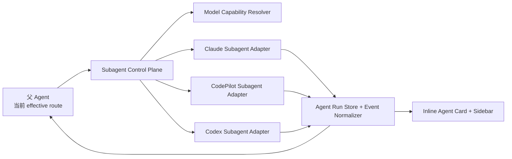

# 多 Runtime / 多模型 Sub-agent 协作可行性调研

> 调研日期：2026-07-22
>
> 修订说明：根据产品取舍，首期从“固定 Profile 驱动跨 Runtime”改为“同 Runtime 下动态切换子 Agent 模型”；跨 Runtime 保留为后续目标。本文是纯调研，未修改产品代码。
>
> 实现后勘误（2026-07-22）：真实复测证明 Claude `AgentDefinition.model` 虽接受 full string，但 child 仍复用父 SDK subprocess 的 Provider endpoint，不能承担 CodePilot 模型选择器意义上的跨 Provider 换模。当前实现因此改用 in-process MCP 启动独立 Claude SDK child，显式绑定 picker 未置灰的 Provider+Model。本文后文有关“动态 AgentDefinition 作为完整模型兼容路径”“首版 Claude 严格 same-provider”的内容只保留为调研过程，不再是 shipping 结论；权威实现合同见 active exec plan 与 Runtime guardrail。
>
> 后续竞品补充（2026-07-24）：VS Code/Copilot、Pydantic AI Harness、OpenAI Agents SDK、Roo Code、Gemini CLI、Cline Agent Teams 与 durable workflow 的横向对照，见 [Sub-agent 编排竞品补充调研](./subagent-orchestration-competitor-followup-2026-07-24.md)。该文重点补 logical run / physical attempt、route fail-closed、settling 终态、结构化 provenance、预算与恢复语义。
>
> 目标：用户当前会话选中的 Runtime / Provider / Model 始终是父 Agent；父 Agent 可以创建有独立身份、模型、历史和运行状态的子 Agent。

术语约定：本文统一用 **父 Agent** 表示当前回合的主控，用 **子 Agent** 表示被委派的独立执行者，用 **child session** 表示它的会话载体，用 **agent run** 表示一次有明确起止与终态的委派执行。

## 结论

**方案可行，而且“同 Runtime、不同子 Agent 模型”比跨 Runtime Broker 更适合作为第一版。** 三条 Runtime 的基础并不相同，但都存在模型覆盖落点：

| 父 Runtime | 同 Runtime 切换子模型 | CodePilot 当前状态 | 判断 |
|---|---|---|---|
| Claude Code Runtime | Claude Code / Agent SDK 支持 subagent `model`，当前官方版本还支持每次调用传 `model` | SDK 参数已能透传 `agents`，但 CodePilot 类型漏了 `model`，也没有把 subagent 生命周期映射成产品事件 | **高可行，需版本 gate + live smoke** |
| CodePilot Runtime | Vercel AI SDK 的 Agent 可单独绑定模型；现有 AgentTool 已把 `agentDef.model` 传入独立 loop | 模型覆盖已存在于内部定义，但 Tool schema 不允许父 Agent 每次动态选模型，Provider 仍继承父会话 | **最高可行，最适合首个落地** |
| Codex Runtime | Codex custom agent 支持单独配置 `model` / reasoning，并创建有父子关系的 thread | CodePilot 当前把 `collabAgentToolCall` 当作 chat-only item 过滤，尚未接 agent run / child thread UI；上游协议命名也已有版本漂移 | **可行，但接线风险最高，先 spike** |

推荐分两层演进：

1. **第一层：Same-runtime Subagent Adapter。** 父 Runtime 和 Provider 不变，只允许从该执行通道真实可用的模型目录中动态选择子模型。先复用各 Runtime 的原生 subagent / agent loop。
2. **第二层：Cross-runtime Delegation Broker。** 等第一层的运行合同、历史、取消、权限和 UI 稳定后，再允许 Claude Code 父 Agent 启动 CodePilot / Grok，或任意父 Runtime 启动 Codex worker。

原先的固定 `x-researcher`、`deepseek-copywriter`、`codex-reviewer` 不应成为产品枚举。产品可以提供可编辑示例或用户模板，但 **模板不是固定路由，也不是委派的前置条件**：同一个 `researcher` 本次可以跑 Sonnet，下次可以跑 Haiku；以后开放跨 Runtime 后，还可以在用户允许的范围内换 Runtime。

## 一、产品取舍

### 1.1 主控由当前会话决定

当前父回合真实生效的 Runtime、Provider 和 Model 就是父 Agent。委派只创建 child route，不能修改 parent route，也不能在父模型不支持工具时偷偷换一个“隐藏主控”。

例子：

- 用户选 Claude Code Runtime + Opus，则 Opus 继续规划和综合；子 Agent 可以在 Claude Code Runtime 内改用 Sonnet / Haiku。
- 用户选 CodePilot Runtime + 某 Provider / Model，则该模型继续主控；第一版子 Agent 只能从同一 Provider 的可用模型中选择。
- 用户选 Codex Runtime + GPT，则 GPT 继续主控；子 Agent 仍由 Codex Runtime 承载，但可以使用另一个 Codex 可用模型。

### 1.2 Agent 身份与执行路由必须拆开

“研究员”“审查员”是 Agent 身份与任务约束；“Claude Code + Sonnet”是某次运行的执行路由。把两者绑成固定 Profile 会产生三个问题：

1. 用户每增加一个模型组合都要复制一个 Profile；
2. 父 Agent 无法根据任务成本、速度和深度动态选择；
3. UI 容易把 Agent 名称、模型名称和 Runtime 混成一个概念。

建议把可选模板设计成可覆盖的默认值：

```ts
interface AgentTemplate {
  id: string;
  name: string;
  description: string;
  icon?: string;
  instructions?: string;
  toolPolicy?: { allow?: string[]; deny?: string[] };
  permissionPolicy?: 'read_only' | 'ask' | 'inherit';
  defaultModelRef?: string;
  maxTurns?: number;
  timeoutSeconds?: number;
}
```

模板应由用户创建、编辑、删除；也可以完全不选模板，直接创建一个临时子 Agent。`defaultModelRef` 只是默认值，每次运行都可被允许范围内的动态选择覆盖。

无模板不等于没有策略：临时子 Agent 的默认 `permissionPolicy` 固定为 `read_only`，不能把缺失模板解释成“完全继承父 Agent 的全部权限”。

### 1.3 第一版不是“任意字符串选模型”

“不固定”不等于让模型编造 model ID。第一版应在每个父回合生成真实 capability snapshot，只向父 Agent 暴露当前 Runtime + Provider 可用的 `modelRef`：

- Claude Code：受当前账号、Provider 映射和 `availableModels` 约束；
- CodePilot Runtime：受当前 Provider 的模型目录、协议兼容和套餐策略约束；
- Codex Runtime：受当前 Codex 账号与 app-server model catalog 约束。

父 Agent 可以动态挑选，但只能从这个集合中选。无效、未授权或跨 Provider 的模型必须在启动前 fail-closed，不能静默换模型后声称成功。

### 1.4 与当前 Claude–Codex loop 无关

这是 CodePilot 普通聊天里的内建产品能力，不依赖 GitHub Issue、review gate、handoff 或当前项目使用的 Claude–Codex 协作 loop。

## 二、三种 Runtime 的事实核对

### 2.1 Claude Code Runtime：SDK 管道接近可用

本仓库安装 `@anthropic-ai/claude-agent-sdk ^0.2.111`。本地 SDK 类型已经明确支持：

- `AgentDefinition.model?: string`，不填或 `inherit` 时继承父模型；
- `maxTurns`、`background`、`effort`、`permissionMode` 等子 Agent 配置；
- `Options.agents?: Record<string, AgentDefinition>`；
- `SubagentStart` / `SubagentStop` hooks，包含 `agent_id`、`agent_type` 和 transcript path。

仓库当前接线也已经走到最后一段：

- `src/lib/runtime/sdk-runtime.ts:58-67` 把 `runtimeOptions.agents` 传入 Claude stream options；
- `src/lib/claude-client.ts:1595-1603` 把它写入 SDK `queryOptions.agents`；
- 但 `src/types/index.ts:1658-1662` 自己声明的 agent shape 只有 description / prompt / tools / disallowedTools，漏掉 `model`、`maxTurns` 等 SDK 字段；
- `src/lib/agent-sdk-agents.ts` 有注册表，但当前没有调用方把它注入真实请求。

官方当前文档还说明：每次 Agent 调用可以单独传 `model`，优先级是环境变量 → per-invocation model → agent definition → 父模型。这里有一个重要陷阱：如果目标模型不在 `availableModels` allowlist 中，上游可能跳过该值并回到 inherited model。因此 CodePilot 不能只显示 requested model，必须记录 effective model；正式实现前还要用 CodePilot 实际打包的 Claude Code 版本做 live smoke，不能只依据最新版网页。

当前 `claude-client.ts` 只把普通 `tool_use` / `tool_result` 扁平化给 UI，没有使用 `agent_id` / `agent_type` 建立 agent run。可行的接入顺序是：

1. 扩全 CodePilot 的 `ClaudeStreamOptions.agents` 类型；
2. 读取当前可用模型并把允许的动态选择交给父 Agent；
3. 优先使用 per-invocation `model`，旧版本则退到“会话内动态生成 AgentDefinition”的兼容路径；
4. 用 `SubagentStart` / `SubagentStop` 与 transcript 信息生成统一 agent run 事件；
5. 比对 requested / effective model，无法确认时标为 unknown，不显示假值。

结论：**模型切换本身不是难点，产品事件和真实生效路由才是缺口。**

### 2.2 CodePilot Runtime：模型覆盖已经存在，只是没有开放

本仓库安装 `ai ^7.0.11`。该版本的 `ToolLoopAgent` 构造参数直接接受一个 `LanguageModel`，并提供 start / step / tool / end 回调、abort 和 timeout；官方推荐的 subagent 形态仍然是 Agent-as-Tool，而不是一个神秘的独立 Runtime。

CodePilot 当前的实现已经近似这个模式：

- `src/lib/agent-registry.ts:9-27` 的 `AgentDefinition` 有 `model?: string`；
- `src/lib/tools/agent.ts:69-89` 计算 `agentDef.model || ctx.parentModel`，再传给独立 `runAgentLoop()`；
- `src/lib/tools/agent.ts:41-44` 的 Tool schema 却只有 `prompt` 和 `agent`；
- `src/lib/tools/agent.ts:81-84` 用临时 `sub-${Date.now()}` session，并固定继承 `ctx.providerId`；
- `src/lib/tools/agent.ts:51-59` 把父 `sessionId` 放进 permission context，`114-119` 再把 child 的 permission request 转发给父流，当前事件无法表达究竟是哪个 run 在请求权限；
- 进度被拼成 `[subagent:...]`、`>`、`[+]` 文本，而不是结构化事件。

因此第一版不必先把现有 loop 重写成 `ToolLoopAgent`。更小的路径是：

1. 给 Agent tool 增加经 capability resolver 验证的 `modelRef`；
2. Phase 1 锁定 `runtime='inherit'` 和 `provider='inherit'`；
3. 把临时 session 改成真实 child session / run ID；
4. 发 typed lifecycle event，不再解析自由文本；
5. 后续再评估是否迁移到 AI SDK 7 `ToolLoopAgent`，避免把框架迁移和产品功能绑在同一个 POC。

结论：**这是最低风险的首个纵向切片。**

### 2.3 Codex Runtime：上游支持，CodePilot 还没把它当产品事件

Codex 官方当前文档允许 custom agent 在独立配置中指定 `model`、`model_reasoning_effort`、sandbox、MCP 与 skills；缺省时继承父 session。Codex 的 child thread 还可以暴露 `parentThreadId`、`agentNickname` 和 `agentRole`。

app-server 当前上游协议把协作调用表示为 `collabToolCall`，字段包括 sender / receiver / new thread ID、prompt 和 agent status。本仓库当前 `src/lib/codex/event-mapper.ts:492-506` 识别的是 `collabAgentToolCall`，并把它放进 `CHAT_ONLY_ITEM_TYPES` 直接返回 null。本机 PATH、Codex Desktop 与 CodePilot 实际拉起的二进制可能不同，因此宿主 shell 的 `codex --version` 只能算环境观察，不能作为产品事实；Phase 0 必须从 CodePilot 实际 app-server 初始化握手记录版本和 schema。

Codex 路径至少要补：

1. 明确当前 app-server 版本究竟接受 per-call model override、custom agent model，还是两者都支持；
2. 把 collab item 映射成统一 agent run，而不是过滤；
3. 用 `newThreadId` / `receiverThreadId` 关联 child session，并读取真实 model / role；
4. 验证非完整历史 fork、权限继承、取消和 resume；
5. 对不同 app-server 版本做 capability gate。

结论：**架构上可行，但不应和 CodePilot Runtime 一起被估成“一行 model 参数”。**

## 三、推荐架构：先 Adapter，后 Broker



第一版 Control Plane 强制 `runtime='inherit'`、`provider='inherit'`。未来跨 Runtime 时再在同一个合同上增加 Delegation Broker，不重做 child session、事件、UI 和持久化。

### 3.1 动态委派请求

建议父 Agent 看到的归一化语义是：

```ts
interface SpawnSubagentRequest {
  task: string;
  agent?: {
    templateId?: string;
    displayName?: string;
  };
  modelRef: string;
  context?: {
    includeRecentTurns?: number; // integer, 0..5; default 0
    artifactIds?: string[];
  };
}
```

首版不暴露 `runtime`、`provider` 或只有一个合法值的 `mode`。`modelRef` 来自本回合动态 capability snapshot，不是固定 union，也不是任意自由字符串。Runtime Adapter 再把这个统一语义映射到：

- Claude 的 Agent per-invocation model / 动态 AgentDefinition；
- CodePilot AgentTool 的 loop model；
- Codex collab tool / custom agent model。

`includeRecentTurns` 默认 `0`、最大 `5`，超出范围直接拒绝而不是静默截断。父历史可能携带密钥、个人信息、陈旧指令和不可信工具输出；即使请求最近回合，也只复制规范化的用户 / assistant 可见文本，工具原文、附件和 artifact 必须通过显式 ID 单独授权。

跨 Runtime 阶段再扩成：

```ts
target: {
  runtimeRef: string;
  providerRef: string;
  modelRef: string;
}
```

此时三者仍必须来自已验证的 capability graph，而不是固定 Profile 或模型臆测。

### 3.2 统一 agent run 合同

```ts
interface AgentRunRecord {
  runId: string;
  parentSessionId: string;
  childSessionId: string;
  parentToolCallId?: string;
  templateId?: string;
  displayName: string;
  icon?: string;
  status: 'queued' | 'running' | 'completed' | 'partial' | 'failed' | 'cancelled' | 'timed_out';
  completionReason?: 'completed' | 'max_turns' | 'runtime_error' | 'cancelled' | 'timeout';
  parentEffectiveRoute: RouteSnapshot;
  requestedRoute: RouteSnapshot;
  effectiveRoute?: RouteSnapshot;
  callScene: 'delegated_interactive';
  startedAt?: number;
  finishedAt?: number;
  usage?: { inputTokens?: number; outputTokens?: number; durationMs?: number };
  error?: { code: string; message: string; retryable: boolean };
}
```

`requestedRoute` 与 `effectiveRoute` 必须分开。Claude allowlist fallback、Codex model reroute 或 Provider alias 映射都可能让二者不同。UI 只能把真实可确认的字段标为“当前模型”；拿不到 usage 或 model 时保持缺失，不能补 `0` 或回显请求值冒充事实。

运行事件至少包括：

- `agent_run_created`
- `agent_run_started`
- `agent_run_progress`
- `agent_run_tool_started` / `agent_run_tool_completed`
- `agent_run_permission_requested` / `agent_run_permission_resolved`
- `agent_run_completed` / `partial` / `failed` / `cancelled` / `timed_out`

每个事件都带 `runId` 和 `childSessionId`，并发时不能靠“最后一个 Agent tool”猜归属。

权限请求事件还必须带唯一 `permissionRequestId`、tool、受影响资源与请求来源；批准 / 拒绝必须按 `permissionRequestId + runId` 命中对应 child。父 session ID 只参与权限上限计算，不能再充当 child 权限事件的路由键。foreground 父回合等待 child 时，permission callback 与 abort 可能重入同一条 stream / session 状态机，必须做无死锁 smoke。

### 3.3 结果与不可信内容

子 Agent 返回父 Agent 的内容仍是工具数据，而不是更高优先级指令：

```ts
interface DelegatedOutput {
  summary: {
    text: string;
    trust: 'delegated_model_output';
    derivedFromUntrustedContent: boolean;
  };
  sources?: Array<{ id: string; title?: string; url: string }>;
  evidence?: Array<{
    sourceId: string;
    excerpt?: string;
    trust: 'external_untrusted';
  }>;
  artifacts?: Array<{ type: string; path?: string; id?: string }>;
}
```

达到 maxTurns 时返回 `partial`，超时返回 `timed_out`；已有内容只能进入 partial result。外部搜索原文只进入带 `external_untrusted` 的 evidence，不允许无标记混进 summary。上述 trust 字段由 Control Plane 根据真实来源事件设置，不能接受子模型自行声明。

## 四、UI / 交互方案

### 4.1 子 Agent 直接出现在聊天流

用户提出的方向合理：子 Agent 不应和 Bash / Read / Grep 一样埋在通用折叠区。

当前实现恰好相反：

- `MessageItem.tsx:695-707` 和 `StreamingMessage.tsx:333-350` 把所有 tool + thinking 放进一个 `ToolActionsGroup`；
- `tool-actions-group.tsx:155-204` 把 `Agent` 当作普通 tool renderer；
- 历史消息在没有运行中工具时默认折叠；
- Agent 进度依赖解析自由文本，最多显示最后 8 行。

建议新增 `SubagentInlineCard`，并在渲染前把 agent run 与普通工具分流：

- Agent card 始终直接显示在对话中，不受 ToolActionsGroup 折叠状态影响；
- 普通 Read / Bash / MCP 工具仍留在原有折叠组；
- 卡片只显示身份、任务摘要、状态和少量实时进度，完整 transcript 放侧边栏，避免主聊天被子 Agent token stream 淹没；
- 消息存储增加有顺序的 `agent_run_ref` content part，保证卡片出现在真实调用位置，而不是简单堆到整条 assistant message 顶部。

建议的紧凑形态：

```text
┌  ◉  代码审查员   GPT-5.6 Terra   运行中  ─────────────┐
│  正在检查 Runtime resolver 与权限继承……              │
│  读取 8 个文件 · 2m 14s                 [查看记录]   │
└───────────────────────────────────────────────────────┘
```

### 4.2 图标表示 Agent 身份，模型单独显示

同一个 Agent 可以切换模型，所以图标不应直接等于模型 Logo。建议拆成两层：

- **Agent identity**：名称、图标 / 字母头像、稳定颜色；来自用户模板或临时 Agent 名称；
- **Run route**：单独的 model badge，必要时附小号 Runtime / Provider 标识。

如果用户没设置图标，可按 `templateId` / display name 生成确定性图标和颜色。状态不能只靠颜色表达，还要有文本或图形；名称与模型字符串都需要长度限制和转义。

### 4.3 胶囊按钮打开侧边栏

卡片上的胶囊按钮建议显示为 `查看记录`，或更紧凑地显示 `Agent 名称 · 模型`。点击后复用现有 Workspace Sidebar，而不是另造一套浮层：

1. 给 `src/lib/workspace-sidebar.ts` 增加动态 Tab kind `agent`；
2. Tab key 使用稳定 `runId` 或 `childSessionId`，重复点击聚焦同一 Tab；
3. `TabPanel` 增加 `AgentRunPanel` 分支；
4. 首版面板只读，后续再加 resume / steer。

侧边栏建议包含：

- Agent 名称、图标、状态；
- requested / effective Runtime、Provider、Model；
- 原始任务、输入上下文范围；
- 按时间排序的 assistant / tool / source / artifact 历史；
- 终态、错误、耗时和真实 usage；
- 权限与工具范围；
- 可用时的停止、重试或打开完整 child session 操作。

胶囊按钮必须可键盘聚焦，并用 `aria-expanded` / `aria-controls` 表达面板关系。卡片与侧边栏应共享同一 `agent_runs` 数据源，不能一个读 SSE 临时状态、另一个读不一致的聊天文本。

## 五、持久化建议

仍推荐 **child session + agent run 分表**：

- child 对话复用 `chat_sessions` 与 messages，新增 `source='subagent'` 用于普通会话列表过滤，并保存 Runtime 自己的 resume / thread handle；
- 新建 `agent_runs`，一次委派一行，保存 parent / child session、nullable template、父 tool call、requested / effective route、状态、终因、时间、usage 与 error；
- agent run 与 child session 分开，因为一次会话可以 resume / retry 多次，而每次 run 都需要独立终态与审计记录。

这也是胶囊按钮在刷新后仍能打开历史的前置条件。具体字段、索引、级联删除和旧库迁移仍需 schema spike；方向上不建议把这些字段继续塞进拼接 tool result。

## 六、安全与可靠性约束

1. **权限不可升级。** `child = parent ceiling ∩ (template?.permissionPolicy ?? read_only) ∩ runtime capability`；换模型或省略模板都不能绕过父任务的 plan / read-only / ask。
2. **只读必须由 Adapter 强制。** Claude Adapter 用 `AgentDefinition.tools` / `disallowedTools` 的只读 allowlist 并叠加不高于父会话的 permission mode；CodePilot Adapter 用 `assembleTools` + `filterTools` 只保留审计过的只读工具，并创建 child 专属 permission context；Codex Adapter 用 read-only sandbox + 父 approval ceiling。任一 Adapter 无法证明约束真实生效时，委派 fail-closed。
3. **Phase 1 使用独立 call scene。** 新增 `delegated_interactive`，明确表示当前可见用户回合内的 foreground child 调用，不能继续冒充 `interactive_chat`。在 Provider 的 `interactive_only` 套餐条款与 policy gate 验证前，Phase 1 对该 Provider 禁用委派入口。
4. **首版同 Runtime、同 Provider。** 跨 Provider 即使仍在 CodePilot Runtime 内，也先归入后续路由阶段，避免模型兼容和套餐政策混在第一版。
5. **深度默认 1。** 子 Agent 不再拥有 spawn 能力；正式开放嵌套前先解决预算、取消和扇出。
6. **并发最多 2。** 每个 run 有独立 event channel、abort controller 和 timeout；取消一个不能命中另一个。
7. **最小上下文。** 默认只给 task brief 和显式 artifact；`includeRecentTurns` 默认 0、最大 5，且不隐式复制工具原文、附件或可能含敏感内容的父历史。
8. **真实路由。** requested / effective 分开；无法确认 effective model 时明确 unknown。
9. **失败关闭。** 不可用模型、旧 Runtime 不支持 per-call override、缺失 child lifecycle 时给明确 capability error，不静默继承后冒充已切换。
10. **外部内容是 data。** 后续 Grok X Search、网页或邮件内容都不能成为父 Agent 指令。
11. **取消向下传播。** 父回合 stop、卡片取消、应用退出都必须让 child 进入终态。
12. **首版只读。** 写权限、并行 worktree 与自动合并属于后续独立安全阶段。

## 七、验收矩阵

| 场景 | 必须看到 | 失败判据 |
|---|---|---|
| CodePilot 父模型 A → 子模型 B | 父 effective route 不变；child requested / effective 都是 B | 子 Agent 仍用 A，或 UI 只回显 B |
| Claude 父 Opus → 子 Sonnet / Haiku | Agent tool 启动成功；记录 agent ID、终态与 effective model | allowlist fallback 后仍显示目标模型 |
| Codex 父模型 A → 子模型 B | 真实 child thread、parent relation、模型与 collab 生命周期 | 只看到普通 tool text，拿不到 child thread |
| 无效 / 未授权模型 | 启动前 `MODEL_UNAVAILABLE` 或明确 fallback mismatch | 静默继承父模型并报完成 |
| 父模型不支持委派 | 入口不可用，父模型保持不变 | 偷换主控模型 |
| UI 历史态 | Agent card 直接出现在聊天，普通工具仍可折叠 | Agent card 被 ToolActionsGroup 一起收起 |
| Agent 身份 | 图标 + Agent 名称 + 模型 badge 可区分 | 只有通用 assistant 图标或只显示模型 |
| 胶囊侧栏 | 点击后打开对应 run 的完整历史；刷新后仍可打开 | 只能看最后 8 行临时文本 |
| 两个 child 并发 | 事件不串台；取消 A 不影响 B | SSE / status / result 归错 run |
| child 权限请求 | UI 显示请求来自哪个 Agent / run；批准或拒绝只命中该 child，并留下 resolved 事件 | 只显示父 session、批准错 run、父子互相卡住 |
| `interactive_only` Provider | 只有 `delegated_interactive` policy gate 通过后才开放；否则入口禁用并解释原因 | 继续复用 `interactive_chat` 绕过套餐语义 |
| 父任务取消 / 应用退出 | abort 向下传播；所有 child 进入 cancelled / failed 终态，父 UI 不再 active | child 遗留运行、父回合永久 active 或结果回灌已取消回合 |
| timeout / maxTurns | `timed_out` 或 `partial + max_turns`，保留可用 partial | 永久 active，或不完整结果冒充 completed |
| 权限非升级 | child 权限不高于父任务与模板 | read-only 父任务通过 child 写文件 |
| usage 缺失 | 不显示该字段或标 unknown | 显示假 0 / 假成本 |

三条 Runtime 的 capability spike 可以分开完成；但如果只接通一条，只能称为“该 Runtime 的 preview”，不能宣称 CodePilot 已全面支持多 Runtime 子 Agent。

## 八、分阶段路线

### Phase 0：三条独立 capability spike

不做完整 UI，只证明真实运行能力：

1. CodePilot Runtime：临时给 Agent tool 传 model B，确认真实请求和结果都使用 B；
2. Claude Code Runtime：用 CodePilot 实际 SDK / CLI 版本验证 per-invocation model、AgentDefinition fallback、allowlist fallback、SubagentStart / Stop 和 cancel；
3. Codex Runtime：锁定 app-server 版本，验证 model override、collab item 名称、child thread metadata 与 interrupt；
4. 用 harness 验证 child permission request 的 run 归属、定向批准 / 拒绝、父取消和 abort；
5. 为每条路径记录 requested / effective route、permission / cancel 的事实来源和不支持项。

建议工程量：约 4–7 个工程日；这是能力验证，不是产品完成。真实账号、模型授权和额度属于外部前置条件，不计入工程日。

### Phase 1：同 Runtime 多模型 foreground MVP

1. 定义统一 SpawnSubagentRequest、AgentRunRecord，以及包含 permission requested / resolved 的 typed lifecycle events；
2. 实现 model capability resolver 与 `delegated_interactive` call scene；首版锁定同 Runtime / 同 Provider，policy 未验证的 `interactive_only` Provider 禁用委派；
3. 先落 CodePilot Adapter，再落 Claude Adapter；Codex Adapter 通过 Phase 0 后接入或先放 capability flag；
4. 持久化 child session + agent run；
5. 把 Agent 从 ToolActionsGroup 分流，加入 inline card、身份图标、模型 badge 和侧边栏 AgentRunPanel；
6. 完成权限事件归属、定向批准 / 拒绝、父取消、timeout、partial、并发隔离和 requested / effective model 验收。

建议工程量：CodePilot + Claude + 共享 UI / 持久化约 2–3 周；Codex 再增加约 4–7 个工程日，取决于 app-server 版本与事件合同。估算不是排期承诺。

### Phase 2：可选 Agent Template 与更强交互

1. Settings 中创建、编辑、删除 Agent Template；
2. 模板提供默认 prompt / tools / permission / model，但允许每次运行覆盖模型；
3. 增加 resume、steer、重试、预算和 background；
4. 评估最多两个只读 child 的并行产品化。

### Phase 3：跨 Runtime 动态路由

1. 在现有 Control Plane 上增加 Cross-runtime Delegation Broker；
2. 动态选择 runtimeRef / providerRef / modelRef，不引入固定 Profile 枚举；
3. 接入 Claude 父 Agent → CodePilot / DeepSeek、Claude 父 Agent → CodePilot / Grok 等路径；
4. Grok X Research 必须先通过 xAI `x_search` entitlement 和 hosted tool 接线，模型名本身不等于已搜索 X；
5. 复用 Phase 1 的 `delegated_interactive` 语义，并对新的跨 Runtime / Provider 组合重新执行套餐 policy gate。

### Phase 4：写协作

1. worktree 隔离与 writer ownership；
2. 冲突检测与显式 merge / cherry-pick 流；
3. inter-agent messaging；
4. 独立安全审计后再开放自动写委派。

### 开工流程门槛

本文仍是 research，不是执行计划。只有用户明确决定实现 Phase 0 / Phase 1 后，才在 `docs/exec-plans/active/` 新建计划，并带状态总览、验收矩阵和 Smoke Ledger。

## 九、开源与官方实现参考

### 9.1 Claude Code

Claude Code 证明了“同一 Runtime 下每个子 Agent 使用不同模型”已经是成熟产品能力。最值得借鉴的不是固定 agent 文件，而是：per-invocation model、独立上下文、生命周期 hook、transcript、foreground / background 和 resume。CodePilot 需要在这些原生事件上补自己的统一 agent run 与 UI。

### 9.2 Vercel AI SDK

AI SDK 的 subagent 是 Agent-as-Tool 组合模式；`ToolLoopAgent` 可以各自绑定 model / instructions / tools，并提供生命周期和取消。CodePilot 当前 Native AgentTool 已经走在这条路上，所以第一版应先补动态 model 与事件合同，不必强制同步完成框架重构。

### 9.3 Codex

Codex custom agents 支持每个 agent 单独设置模型与 reasoning，app-server 还提供有父子关系的 thread 和 collab tool item。它最适合作为 child session / nickname / history UX 的参考；CodePilot 需要先解决协议版本漂移与当前 event mapper 过滤问题。

### 9.4 Craft Agents / OpenCode

Craft Agents 的 `spawn_session` 支持动态 connection / model，并把 child session 作为稳定协作单元；这是跨 Runtime 阶段很好的参考。OpenCode 更偏向在 agent config 中固定 model，Task tool 本身没有成熟的 raw dynamic model override。CodePilot 此处应选择更动态的方向，但仍借鉴 OpenCode 的 parent deny 传播与权限不可升级。

## 十、待验证问题

1. CodePilot 实际打包的 Claude Code 版本是否支持 per-invocation model，以及 resume 时是否保持模型；`claude_code_version` 应进入 smoke 记录。
2. Claude subagent effective model 能否从事件 / transcript 稳定获得；若只能根据 allowlist 推断，UI 应如何标记可信度。
3. CodePilot Runtime 同 Provider 模型切换时，哪些 Provider transport / tool schema 组合不兼容；resolver 需要什么 capability 字段。
4. CodePilot 当前实际使用的 Codex app-server 对应 `collabAgentToolCall` 还是 `collabToolCall`，以及是否暴露 direct model override。
5. foreground 父回合等待 child 时，permission callback / abort 会不会重入同一 stream、锁或 session 状态机并造成死锁；三个 Adapter 都要有定向批准、拒绝和取消 smoke。
6. child transcript 如何无损映射为 `agent_run_ref` content parts，并在 streaming / history 两条渲染链保持顺序一致。
7. `chat_sessions(source='subagent') + agent_runs` 的字段、索引、级联删除、旧库迁移与 source whitelist。
8. Phase 1 的 `delegated_interactive` 对 Qwen Token Plan 等 `interactive_only` 套餐是否符合产品条款；确认前对应 Provider 禁用委派，background 继续禁用。

## 十一、来源

官方资料：

- [Claude Code custom subagents](https://code.claude.com/docs/en/sub-agents) — 独立上下文、每个 agent / 每次调用的 model、allowlist resolution、权限、hooks、transcript 与 resume。
- [Vercel AI SDK subagents](https://ai-sdk.dev/docs/agents/subagents) — Agent-as-Tool、独立 model / instructions / tools 与进度流。
- [Vercel AI SDK ToolLoopAgent](https://ai-sdk.dev/docs/reference/ai-sdk-core/tool-loop-agent) — model、lifecycle callback、abort、timeout 与 UI stream。
- [Codex subagents](https://developers.openai.com/codex/subagents) — custom agent model / reasoning、child thread、权限继承、max depth 与 nickname。
- [Codex app-server README](https://github.com/openai/codex/blob/main/codex-rs/app-server/README.md) — `collabToolCall`、child thread ID、parentThreadId、agentNickname / agentRole 与 thread history。
- [xAI X Search](https://docs.x.ai/developers/tools/x-search) — 后续跨 Runtime Grok 用例的 `x_search` hosted tool 与 citations。

开源实现：

- [Craft Agents OSS](https://github.com/craft-ai-agents/craft-agents-oss) — Claude Agent SDK + Pi 双 backend、dynamic connection / model 与 parent-linked child session。
- [Craft Agents LLM Connections](https://agents.craft.do/docs/reference/config/llm-connections) — session connection lock 与解析优先级。
- [OpenCode agents](https://opencode.ai/docs/agents/) — agent model config、subagent 继承与权限配置。
- [OpenCode Task tool](https://github.com/anomalyco/opencode/blob/0a601cf334b9a83cc2854108a2b860f25e6e7e8e/packages/opencode/src/tool/task.ts) — child session、模型继承、depth 与 cancel。

项目内事实基线：

- `package.json`
- `src/types/index.ts`
- `src/lib/agent-sdk-agents.ts`
- `src/lib/claude-client.ts`
- `src/lib/runtime/sdk-runtime.ts`
- `src/lib/agent-registry.ts`
- `src/lib/tools/agent.ts`
- `src/lib/agent-loop.ts`
- `src/lib/codex/event-mapper.ts`
- `src/components/ai-elements/tool-actions-group.tsx`
- `src/components/chat/MessageItem.tsx`
- `src/components/chat/StreamingMessage.tsx`
- `src/lib/workspace-sidebar.ts`
- `src/components/layout/WorkspaceSidebar/TabPanel.tsx`
- `docs/research/ai-sdk-7-runtime-adoption-2026-06-29.md`
- `docs/research/sub-agent-system.md`
